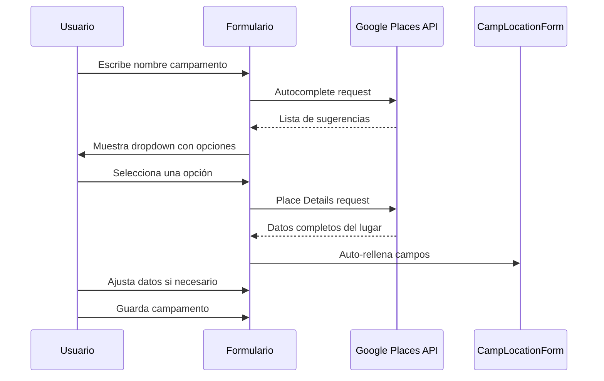

# Google Places API - Auto-completado de Datos de Campamento

## Objetivo

Facilitar la creación de fichas de campamento mediante la integración de Google Places API para auto-completar datos de ubicación a partir del nombre del campamento.

## Contexto

Actualmente, al crear un nuevo campamento, el usuario debe introducir manualmente todos los datos:

- Nombre
- Descripción
- Latitud
- Longitud
- Precios base

Esta tarea es tediosa y propensa a errores, especialmente en las coordenadas geográficas.

## Solución Propuesta

Integrar Google Places API para permitir:

1. **Búsqueda autocompletada** al escribir el nombre del campamento
2. **Selección de ubicación** de las sugerencias de la API
3. **Auto-rellenado automático** de campos con datos de Google Places

## Flujo de Usuario



## Integración con Google Places API

### 1. APIs a Utilizar

#### Places Autocomplete API

**Propósito:** Obtener sugerencias mientras el usuario escribe

**Endpoint:** `https://maps.googleapis.com/maps/api/place/autocomplete/json`

**Parámetros:**

- `input`: Texto introducido por el usuario
- `key`: API Key de Google
- `types`: `establishment|geocode` (lugares y direcciones)
- `language`: `es` (respuestas en español)
- `components`: `country:es` (opcional, para limitar a España)

**Respuesta esperada:**

```json
{
  "predictions": [
    {
      "description": "Camping El Pinar, Calle Example, Madrid",
      "place_id": "ChIJ...",
      "structured_formatting": {
        "main_text": "Camping El Pinar",
        "secondary_text": "Calle Example, Madrid"
      }
    }
  ]
}
```

#### Place Details API

**Propósito:** Obtener información completa del lugar seleccionado

**Endpoint:** `https://maps.googleapis.com/maps/api/place/details/json`

**Parámetros:**

- `place_id`: ID del lugar seleccionado
- `key`: API Key de Google
- `fields`: Campos específicos a solicitar
- `language`: `es`

**Campos a solicitar (`fields` parameter):**

- `name` - Nombre del lugar
- `formatted_address` - Dirección formateada
- `geometry` - Coordenadas (lat/lng)
- `types` - Tipos de lugar
- `photos` - Referencias a fotos (opcional, para futuro)
- `rating` - Valoración (opcional)
- `website` - Sitio web (opcional)
- `formatted_phone_number` - Teléfono (opcional)

**Respuesta esperada (ver archivo JSON de ejemplo adjunto):**

```
[PLACEHOLDER - El usuario proporcionará un ejemplo real]
```

### 2. Configuración de API Key

La API Key debe configurarse de forma segura:

**Backend (Recomendado):**

- Almacenar API Key en variables de entorno
- Crear endpoint proxy en backend: `POST /api/places/autocomplete` y `POST /api/places/details`
- El frontend llama al backend, no directamente a Google
- Ventajas: Seguridad, control de rate limiting, logging

**Frontend (Alternativa):**

- API Key en `.env.local` (nunca en código)
- Restricciones por dominio en Google Cloud Console
- Menos seguro pero más simple para MVP

## Especificación Técnica

### Frontend Changes

#### 1. Nuevo Composable: `useGooglePlaces.ts`

**Ubicación:** `frontend/src/composables/useGooglePlaces.ts`

**Responsabilidades:**

- Realizar llamadas a Google Places API (o proxy backend)
- Gestionar estado de loading y errores
- Parsear respuestas de la API

**Interfaz:**

```typescript
export interface PlaceAutocomplete {
  placeId: string
  description: string
  mainText: string
  secondaryText: string
}

export interface PlaceDetails {
  placeId: string
  name: string
  formattedAddress: string
  latitude: number
  longitude: number
  types: string[]
  photos?: string[]
  website?: string
  phoneNumber?: string
}

export function useGooglePlaces() {
  const loading = ref(false)
  const error = ref<string | null>(null)

  const searchPlaces = async (input: string): Promise<PlaceAutocomplete[]>
  const getPlaceDetails = async (placeId: string): Promise<PlaceDetails | null>

  return {
    loading,
    error,
    searchPlaces,
    getPlaceDetails
  }
}
```

#### 2. Componente: Autocomplete Input

**Opción A: Modificar CampLocationForm.vue**
Añadir funcionalidad de autocomplete al campo de nombre existente

**Opción B: Crear componente reutilizable**
`frontend/src/components/common/PlacesAutocomplete.vue`

**Funcionalidad requerida:**

- Input con debounce (300-500ms) para evitar llamadas excesivas
- Dropdown con sugerencias (usando PrimeVue AutoComplete)
- Loading state mientras se buscan sugerencias
- Manejo de errores de API
- Selección de sugerencia dispara obtención de detalles
- Auto-rellenado de formulario con datos obtenidos

#### 3. Modificaciones en CampLocationForm.vue

**Cambios necesarios:**

1. **Importar composable y componente:**

```typescript
import { useGooglePlaces } from '@/composables/useGooglePlaces'
import PlacesAutocomplete from '@/components/common/PlacesAutocomplete.vue'
// o usar PrimeVue AutoComplete directamente
```

1. **Lógica de auto-rellenado:**

```typescript
const { searchPlaces, getPlaceDetails } = useGooglePlaces()

const handlePlaceSelected = async (placeId: string) => {
  const details = await getPlaceDetails(placeId)
  if (details) {
    // Auto-rellenar campos
    formData.name = details.name
    formData.latitude = details.latitude
    formData.longitude = details.longitude
    // Generar descripción base si está vacía
    if (!formData.description) {
      formData.description = generateDescription(details)
    }
  }
}

const generateDescription = (details: PlaceDetails): string => {
  // Generar descripción basada en tipos de lugar y dirección
  const typeDescriptions: Record<string, string> = {
    'campground': 'Zona de camping',
    'park': 'Parque natural',
    'lodging': 'Alojamiento'
  }
  // Lógica para crear descripción automática
  return `${details.name} ubicado en ${details.formattedAddress}`
}
```

1. **UI Changes:**

```vue
<template>
  <!-- Campo de nombre con autocomplete -->
  <div>
    <label for="name" class="mb-1 block text-sm font-medium text-gray-700">
      Nombre del Campamento *
      <span class="text-xs text-gray-500">(Empieza a escribir para buscar)</span>
    </label>

    <AutoComplete
      id="name"
      v-model="formData.name"
      :suggestions="placeSuggestions"
      @complete="searchPlaces($event.query)"
      @item-select="handlePlaceSelected($event.value.placeId)"
      option-label="description"
      placeholder="Buscar ubicación..."
      class="w-full"
    >
      <template #item="{ item }">
        <div class="flex flex-col">
          <span class="font-semibold">{{ item.mainText }}</span>
          <span class="text-sm text-gray-500">{{ item.secondaryText }}</span>
        </div>
      </template>
    </AutoComplete>

    <!-- Opcional: Botón para limpiar y escribir manualmente -->
    <Button
      v-if="formData.name"
      label="Escribir manualmente"
      icon="pi pi-pencil"
      text
      size="small"
      class="mt-1"
      @click="clearAutocomplete"
    />
  </div>

  <!-- Indicador visual cuando se auto-completó -->
  <Message
    v-if="autoCompletedFromPlaces"
    severity="info"
    :closable="false"
    class="mt-2"
  >
    <i class="pi pi-check-circle mr-2"></i>
    Datos cargados desde Google Places. Puedes ajustarlos antes de guardar.
  </Message>

  <!-- Resto de campos: latitud, longitud, etc. -->
  <!-- Mostrar coordenadas con indicador que fueron auto-completadas -->
</template>
```

### Backend Changes (Proxy Approach)

#### 1. Nuevo Controlador: PlacesController

**Ubicación:** `backend/Controllers/PlacesController.cs`

**Endpoints:**

```csharp
[ApiController]
[Route("api/[controller]")]
public class PlacesController : ControllerBase
{
    private readonly IGooglePlacesService _placesService;

    [HttpPost("autocomplete")]
    public async Task<IActionResult> Autocomplete([FromBody] AutocompleteRequest request)
    {
        // Validación
        // Llamada a Google Places Autocomplete API
        // Retornar sugerencias
    }

    [HttpPost("details")]
    public async Task<IActionResult> GetDetails([FromBody] DetailsRequest request)
    {
        // Validación
        // Llamada a Google Places Details API
        // Retornar detalles del lugar
    }
}
```

#### 2. Servicio: GooglePlacesService

**Ubicación:** `backend/Services/GooglePlacesService.cs`

**Responsabilidades:**

- HttpClient configurado para Google Places API
- Construcción de URLs con parámetros
- Manejo de respuestas y errores
- Rate limiting y caching (opcional)

**Interfaz:**

```csharp
public interface IGooglePlacesService
{
    Task<AutocompleteResponse> SearchPlacesAsync(string input, string? language = "es");
    Task<PlaceDetailsResponse> GetPlaceDetailsAsync(string placeId, string? language = "es");
}
```

#### 3. Configuración

**appsettings.json:**

```json
{
  "GooglePlaces": {
    "ApiKey": "", // Dejarlo vacío, usar User Secrets
    "AutocompleteUrl": "https://maps.googleapis.com/maps/api/place/autocomplete/json",
    "DetailsUrl": "https://maps.googleapis.com/maps/api/place/details/json"
  }
}
```

**User Secrets (desarrollo):**

```bash
dotnet user-secrets set "GooglePlaces:ApiKey" "YOUR_API_KEY_HERE"
```

**Variables de entorno (producción):**

```
GOOGLE_PLACES_API_KEY=your_production_key
```

## Mapeo de Datos

### De Google Places → Camp Model

| Campo Google Places | Campo Camp | Transformación |
|-------------------|-----------|--------------|
| `name` | `name` | Directo |
| `geometry.location.lat` | `latitude` | Directo |
| `geometry.location.lng` | `longitude` | Directo |
| `formatted_address` + `types` | `description` | Generar descripción automática |
| - | `basePriceAdult` | Mantener valor por defecto o último usado |
| - | `basePriceChild` | Mantener valor por defecto o último usado |
| - | `basePriceBaby` | Mantener valor por defecto o último usado |
| - | `status` | 'Active' por defecto |

### Descripción Automática - Lógica

Generar descripción basada en:

1. **Tipos de lugar:** Traducir tipos de Google a descripciones en español
2. **Dirección:** Incluir ciudad/provincia
3. **Template sugerido:**

   ```
   "[Tipo de lugar] ubicado en [Ciudad, Provincia]. [Dirección completa]"

   Ejemplo:
   "Zona de camping ubicada en Galapagar, Madrid. Calle del Pinar, 123, 28260 Galapagar, Madrid"
   ```

## Consideraciones de UX

### 1. Estados de Carga

- Mostrar spinner mientras se buscan sugerencias
- Mostrar spinner mientras se cargan detalles del lugar seleccionado
- Deshabilitar campos mientras se auto-completan

### 2. Manejo de Errores

- API Key inválida o expirada
- Límite de cuota excedido
- Sin conexión a internet
- Lugar no encontrado
- Mostrar error amigable con opción de "Introducir manualmente"

### 3. Edición Manual

- Permitir siempre editar campos auto-completados
- Botón para limpiar autocomplete y escribir manualmente
- Indicador visual de qué campos fueron auto-completados

### 4. Mobile-Friendly

- Autocomplete debe funcionar bien en mobile
- Dropdown de sugerencias debe ser touch-friendly

## Costos y Límites

### Google Places API Pricing (2026)

**Autocomplete - Per Session:**

- Primeras 100,000 solicitudes/mes: $0.00 (gratis)
- Siguientes: $2.83 por 1,000 solicitudes

**Place Details:**

- Basic Data: $0.017 por solicitud
- Contact Data: $0.030 por solicitud
- Atmosphere Data: $0.050 por solicitud

**Optimizaciones para reducir costos:**

1. Usar debounce agresivo (500ms) en autocomplete
2. Caché de resultados frecuentes
3. Limitar número de sugerencias mostradas
4. Solo solicitar campos necesarios en Place Details
5. Implementar rate limiting por usuario

## Testing

### Unit Tests

**Frontend:**

- `useGooglePlaces.test.ts` - Mock de llamadas API
- Validación de transformación de datos
- Manejo de errores

**Backend:**

- `PlacesControllerTests.cs` - Tests de endpoints
- `GooglePlacesServiceTests.cs` - Mock de HttpClient

### E2E Tests

**Cypress:**

```typescript
describe('Camp Creation with Google Places', () => {
  it('should autocomplete camp data when selecting from Google Places', () => {
    cy.visit('/camps/locations')
    cy.get('[data-cy=new-camp-btn]').click()

    // Mock Google Places API responses
    cy.intercept('POST', '/api/places/autocomplete', {
      fixture: 'places-autocomplete.json'
    })
    cy.intercept('POST', '/api/places/details', {
      fixture: 'places-details.json'
    })

    // Type and select
    cy.get('[data-cy=camp-name-input]').type('Camping')
    cy.get('[data-cy=place-suggestion]').first().click()

    // Verify auto-filled data
    cy.get('[data-cy=latitude-input]').should('not.have.value', '')
    cy.get('[data-cy=longitude-input]').should('not.have.value', '')
  })
})
```

## Archivos de Ejemplo

### Respuesta JSON de Google Places Details API

**Archivo:** `ai-specs/changes/feat-camps-definition/examples/google-places-response.json`

```json
[PLACEHOLDER - Adjuntar archivo con respuesta real de la API]
```

## Fases de Implementación

### Fase 1: Backend Proxy (Recomendado primero)

1. Crear GooglePlacesService
2. Crear PlacesController
3. Configurar API Key
4. Tests unitarios backend

### Fase 2: Frontend Composable

1. Crear useGooglePlaces composable
2. Implementar llamadas al backend proxy
3. Tests unitarios frontend

### Fase 3: UI Integration

1. Modificar CampLocationForm con autocomplete
2. Implementar lógica de auto-rellenado
3. Añadir indicadores visuales
4. Manejo de errores UX

### Fase 4: Testing & Refinamiento

1. Tests E2E
2. Testing manual en diferentes escenarios
3. Optimizaciones de performance
4. Refinamiento de UX

## Criterios de Aceptación

- [ ] Al escribir en el campo nombre, aparecen sugerencias de Google Places
- [ ] Al seleccionar una sugerencia, se auto-rellenan los campos:
  - [ ] Nombre
  - [ ] Latitud
  - [ ] Longitud
  - [ ] Descripción (generada automáticamente)
- [ ] Los campos auto-completados son editables manualmente
- [ ] Existe opción para "Introducir manualmente" ignorando autocomplete
- [ ] Indicador visual muestra qué datos fueron auto-completados
- [ ] Errores de API se manejan gracefully con mensajes amigables
- [ ] API Key está segura (no expuesta en frontend)
- [ ] Funciona en mobile y desktop
- [ ] Tests unitarios y E2E implementados

## Próximos Pasos

1. **Obtener Google Places API Key**
   - Crear proyecto en Google Cloud Console
   - Activar Places API
   - Configurar restricciones de API key

2. **Proporcionar JSON de ejemplo**
   - El usuario debe proporcionar un ejemplo real de respuesta de Google Places Details API
   - Guardarlo en `ai-specs/changes/feat-camps-definition/examples/google-places-response.json`

3. **Priorizar enfoque**
   - Decidir: Backend proxy vs Frontend directo
   - Recomendación: Backend proxy para seguridad

4. **Implementar según fases**

## Referencias

- [Google Places API Documentation](https://developers.google.com/maps/documentation/places/web-service)
- [Places Autocomplete](https://developers.google.com/maps/documentation/places/web-service/autocomplete)
- [Place Details](https://developers.google.com/maps/documentation/places/web-service/details)
- [PrimeVue AutoComplete](https://primevue.org/autocomplete/)

## Notas Adicionales

- Considerar implementar caché de lugares frecuentes en backend
- En el futuro, podríamos usar las fotos de Google Places para el campamento
- Valorar añadir validación de que el lugar seleccionado es apropiado para un campamento (tipos: campground, park, etc.)
