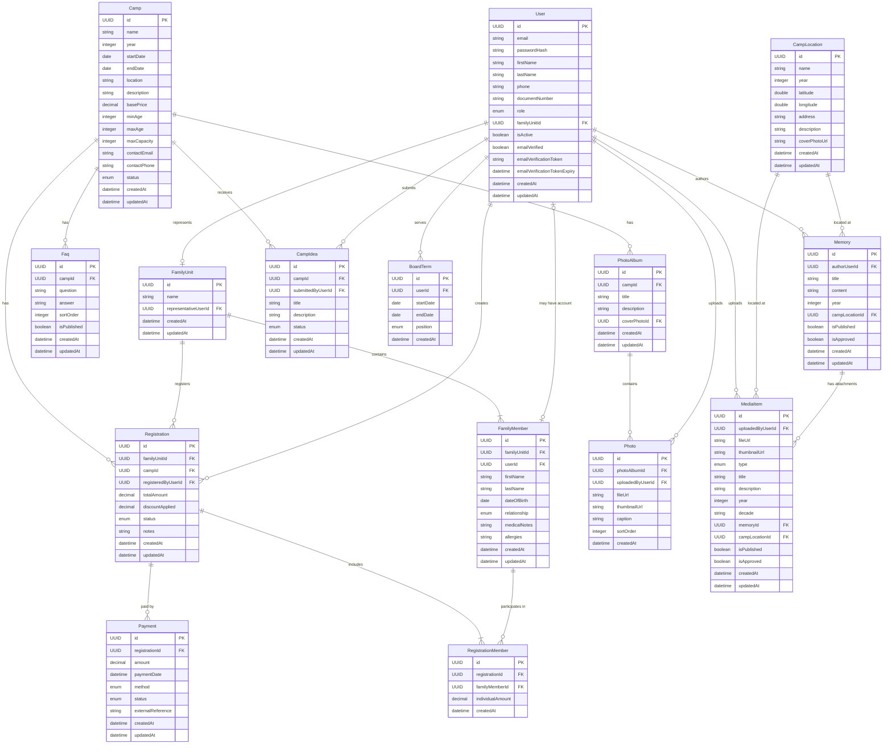

# Data Model Documentation

This document describes the data model for the ABUVI web application, optimized for LLM consumption. Each entity includes its fields, validation rules, and relationships in a single block.

## Entities

### User

Represents a platform account for accessing the application. Each user is a member (socio/a) of the association with a specific role.

**Fields:**

- `id`: Unique identifier for the User entity (Primary Key, UUID)
- `email`: User login email (required, unique, max 255 characters, valid email format)
- `passwordHash`: Hashed password for authentication (required)
- `firstName`: User first name (required, max 100 characters)
- `lastName`: User last name (required, max 100 characters)
- `phone`: Contact phone number (optional, max 20 characters, E.164 format)
- `documentNumber`: National ID/passport number (optional, max 50 characters, unique when not null, uppercase alphanumeric)
- `role`: User role in the system (required, enum: `Admin` | `Board` | `Member`, default: `Member`)
- `familyUnitId`: Reference to the FamilyUnit this user represents (optional, FK -> FamilyUnit)
- `isActive`: Whether the account is active (required, default: false)
- `emailVerified`: Whether the email has been verified (required, default: false)
- `emailVerificationToken`: Token for email verification (optional, max 512 characters, URL-safe base64)
- `emailVerificationTokenExpiry`: Token expiration datetime (optional, defaults to 24 hours from creation)
- `createdAt`: Record creation timestamp (required, auto-generated)
- `updatedAt`: Last update timestamp (required, auto-updated)

**Validation rules:**

- Email must be unique across all users
- DocumentNumber must be unique across all users when provided (partial unique index)
- DocumentNumber format: uppercase letters and numbers only (e.g., "12345678A", "AB123456")
- Role determines access level: Admin (full system access), Board (camp management, registration oversight, payment control), Member (basic access, family registration)
- A user with role Board must have an active BoardTerm to exercise board privileges
- If familyUnitId is set, the user must have role Member and be the representative of that family unit
- Inactive users (isActive = false) cannot log in or perform any actions
- New users start with isActive = false and emailVerified = false
- Users must verify their email before the account becomes active
- Email verification tokens expire after 24 hours
- Once email is verified, both emailVerified and isActive become true

**Relationships:**

- One User can represent zero or one FamilyUnit (via `familyUnitId`)
- One User can create many Registrations (as `registeredByUserId`)
- One User can serve in many BoardTerms
- One User can upload many Photos, Memories, MediaItems, and CampIdeas

---

### FamilyUnit

Groups people who attend camp together as a family. A User acts as the representative of their family unit.

**Fields:**

- `id`: Unique identifier for the FamilyUnit entity (Primary Key, UUID)
- `name`: Family display name, e.g. "Garcia Family" (required, max 200 characters)
- `representativeUserId`: User who manages this family unit (required, FK -> User)
- `createdAt`: Record creation timestamp (required, auto-generated)
- `updatedAt`: Last update timestamp (required, auto-updated)

**Validation rules:**

- Each FamilyUnit must have exactly one representative User
- The representative User must have an active account

**Relationships:**

- One FamilyUnit has exactly one representative User (via `representativeUserId`)
- One FamilyUnit contains many FamilyMembers
- One FamilyUnit can have many Registrations (one per camp)

---

### FamilyMember

A person (child or adult) within a family unit. In the future, a FamilyMember may gain their own User account for self-access to the platform.

**Fields:**

- `id`: Unique identifier for the FamilyMember entity (Primary Key, UUID)
- `familyUnitId`: The family unit this person belongs to (required, FK -> FamilyUnit)
- `userId`: Optional linked User account for future self-access (optional, FK -> User)
- `firstName`: Person first name (required, max 100 characters)
- `lastName`: Person last name (required, max 100 characters)
- `dateOfBirth`: Date of birth, used for camp age validation (required)
- `relationship`: Relationship type within the family unit (required, enum: `Parent` | `Child` | `Sibling` | `Spouse` | `Other`)
- `documentNumber`: National ID/passport number (optional, max 50 characters, uppercase alphanumeric, e.g., "12345678A", "ABC123")
- `email`: Email address (optional, max 255 characters, valid email format)
- `phone`: Contact phone number (optional, max 20 characters, E.164 format, e.g., "+34612345678")
- `medicalNotes`: Medical information (optional, max 2000 characters, sensitive data, must be stored encrypted at rest)
- `allergies`: Allergy information (optional, max 1000 characters, sensitive data, must be stored encrypted at rest)
- `createdAt`: Record creation timestamp (required, auto-generated)
- `updatedAt`: Last update timestamp (required, auto-updated)

**Validation rules:**

- DateOfBirth must be a valid past date
- Relationship enum now includes: Parent, Child, Sibling, Spouse, Other
- DocumentNumber format: uppercase letters and numbers only (e.g., "12345678A", "ABC123")
- Email must be a valid email format when provided
- Phone must be in E.164 format when provided (e.g., "+34612345678")
- MedicalNotes (max 2000 chars) and Allergies (max 1000 chars) must be encrypted at rest (AES-256) due to sensitive health data
- Sensitive fields (medical notes, allergies) are NEVER exposed in API responses - only boolean flags indicating presence
- A FamilyMember can only belong to one FamilyUnit

**Relationships:**

- Each FamilyMember belongs to exactly one FamilyUnit (via `familyUnitId`)
- Each FamilyMember may optionally link to one User account (via `userId`)
- One FamilyMember can appear in many RegistrationMembers (across different camps)

---

### Camp

A camp event/edition organized by the association. Represents a specific camp happening in a given year and location.

**Fields:**

- `id`: Unique identifier for the Camp entity (Primary Key, UUID)
- `name`: Camp name (required, max 200 characters)
- `year`: Camp year (required, integer, e.g. 2026)
- `startDate`: Camp start date (required)
- `endDate`: Camp end date (required)
- `location`: Camp location description (required, max 500 characters)
- `coordinates`: Geographic coordinates for the camp location (optional, e.g. "40.4168,-3.7038")
- `description`: Detailed camp description (optional, rich text)
- `basePrice`: Base price per person in euros (required, decimal, >= 0)
- `maxCapacity`: Maximum number of participants (required, integer, > 0)
- `contactEmail`: Contact email for inquiries (optional, valid email format)
- `contactPhone`: Contact phone for inquiries (optional, max 20 characters)
- `status`: Current camp status (required, enum: `Draft` | `Open` | `Closed` | `Completed`)
- `createdAt`: Record creation timestamp (required, auto-generated)
- `updatedAt`: Last update timestamp (required, auto-updated)

**Validation rules:**

- EndDate must be after StartDate
- BasePrice must be >= 0
- MaxCapacity must be > 0
- Status transitions: Draft -> Open -> Closed -> Completed (no backwards transitions)
- Registrations can only be created when status is Open

**Relationships:**

- One Camp can have many Registrations
- One Camp can have many Faqs (camp-specific FAQs)
- One Camp can have many PhotoAlbums
- One Camp can have many CampIdeas
- One Camp can have many Documents
- One Camp can have many 'Comisiones' (committees or groups responsible for organizing different aspects of the camp, e.g. logistics, activities, food)

---

### Registration

A family's registration to a specific camp. One registration per family per camp, containing the list of family members attending.

**Fields:**

- `id`: Unique identifier for the Registration entity (Primary Key, UUID)
- `familyUnitId`: The family being registered (required, FK -> FamilyUnit)
- `campId`: The camp being registered for (required, FK -> Camp)
- `registeredByUserId`: User who created the registration (required, FK -> User)
- `totalAmount`: Calculated total amount for all members in euros (required, decimal, >= 0)
- `status`: Current registration status (required, enum: `Pending` | `Confirmed` | `Cancelled`)
- `notes`: Additional notes from the registering user (optional, max 1000 characters)
- `createdAt`: Record creation timestamp (required, auto-generated)
- `updatedAt`: Last update timestamp (required, auto-updated)

**Validation rules:**

- Unique constraint on (familyUnitId, campId): one registration per family per camp
- TotalAmount is calculated as the sum of all RegistrationMember.individualAmount
- Status transitions: Pending -> Confirmed (when fully paid) or Pending -> Cancelled. Confirmed -> Cancelled is also allowed
- Camp must have status Open to accept new registrations

**Relationships:**

- Each Registration belongs to one FamilyUnit (via `familyUnitId`)
- Each Registration belongs to one Camp (via `campId`)
- Each Registration is created by one User (via `registeredByUserId`)
- One Registration includes many RegistrationMembers (at least one)
- One Registration can have many Payments (partial or full)

---

### RegistrationMember

Links specific family members to a registration. Tracks which members of a family are attending a specific camp and their individual cost.

**Fields:**

- `id`: Unique identifier for the RegistrationMember entity (Primary Key, UUID)
- `registrationId`: The registration this belongs to (required, FK -> Registration)
- `familyMemberId`: The family member being registered (required, FK -> FamilyMember)
- `individualAmount`: Calculated amount for this member in euros (required, decimal, >= 0)
- `createdAt`: Record creation timestamp (required, auto-generated)

**Validation rules:**

- Unique constraint on (registrationId, familyMemberId): each family member can only appear once per registration
- The FamilyMember must belong to the same FamilyUnit as the Registration
- The FamilyMember's age (calculated from dateOfBirth at camp startDate) must be between Camp.minAge and Camp.maxAge
- The total count of RegistrationMembers across all Registrations for a Camp must not exceed Camp.maxCapacity

**Relationships:**

- Each RegistrationMember belongs to one Registration (via `registrationId`)
- Each RegistrationMember references one FamilyMember (via `familyMemberId`)

---

### Payment

A partial or full payment for a registration. Supports multiple payments per registration (deposit + remaining balance).

**Fields:**

- `id`: Unique identifier for the Payment entity (Primary Key, UUID)
- `registrationId`: The registration being paid for (required, FK -> Registration)
- `amount`: Payment amount in euros (required, decimal, > 0)
- `paymentDate`: When the payment was made (required, datetime)
- `method`: Payment method used (required, enum: `Card` | `Transfer` | `Cash`)
- `status`: Current payment status (required, enum: `Pending` | `Completed` | `Failed` | `Refunded`)
- `externalReference`: Payment gateway transaction ID, e.g. Redsys reference (optional, max 255 characters)
- `createdAt`: Record creation timestamp (required, auto-generated)
- `updatedAt`: Last update timestamp (required, auto-updated)

**Validation rules:**

- Amount must be greater than 0
- The sum of all Completed payments for a Registration must not exceed Registration.totalAmount
- When the sum of Completed payments equals Registration.totalAmount, the Registration status should transition to Confirmed
- ExternalReference is required when method is Card (payment gateway integration)

**Relationships:**

- Each Payment belongs to one Registration (via `registrationId`)

---

### Faq

Dynamic FAQ entry, optionally linked to a specific camp or general to the association.

**Fields:**

- `id`: Unique identifier for the Faq entity (Primary Key, UUID)
- `campId`: Linked camp for camp-specific FAQs (optional, FK -> Camp. When null, the FAQ applies to the association in general)
- `question`: The question text (required, max 500 characters)
- `answer`: The answer text (required, rich text)
- `sortOrder`: Display order, lower numbers appear first (required, integer, >= 0)
- `isPublished`: Whether the FAQ is visible to users (required, default: false)
- `createdAt`: Record creation timestamp (required, auto-generated)
- `updatedAt`: Last update timestamp (required, auto-updated)

**Validation rules:**

- SortOrder must be >= 0
- Only published FAQs (isPublished = true) are shown to regular users
- FAQs can only be created/edited by users with Admin or Board role

**Relationships:**

- Each Faq optionally belongs to one Camp (via `campId`). When campId is null, it is a general association FAQ

---

### BoardTerm

Tracks board (Junta) membership periods. Board members are elected in assembly for 2-year terms and have elevated privileges in the system.

**Fields:**

- `id`: Unique identifier for the BoardTerm entity (Primary Key, UUID)
- `userId`: The user serving on the board (required, FK -> User)
- `startDate`: Term start date (required)
- `endDate`: Term end date (required)
- `position`: Board position held (required, enum: `President` | `Secretary` | `Treasurer` | `Member`)
- `createdAt`: Record creation timestamp (required, auto-generated)

**Validation rules:**

- EndDate must be after StartDate
- A User should not have overlapping BoardTerms for the same position
- Board terms are typically 2 years but the system does not enforce a fixed duration

**Relationships:**

- Each BoardTerm belongs to one User (via `userId`)

---

### PhotoAlbum

A photo album associated with a specific camp edition. Part of the private area accessible to members.

**Fields:**

- `id`: Unique identifier for the PhotoAlbum entity (Primary Key, UUID)
- `campId`: The camp this album belongs to (required, FK -> Camp)
- `title`: Album title (required, max 200 characters)
- `description`: Album description (optional, max 500 characters)
- `coverPhotoId`: Photo used as album cover (optional, FK -> Photo)
- `createdAt`: Record creation timestamp (required, auto-generated)
- `updatedAt`: Last update timestamp (required, auto-updated)

**Validation rules:**

- CoverPhotoId, when set, must reference a Photo that belongs to this same album
- Albums can only be created by users with Admin or Board role

**Relationships:**

- Each PhotoAlbum belongs to one Camp (via `campId`)
- One PhotoAlbum contains many Photos
- One PhotoAlbum optionally references one Photo as cover (via `coverPhotoId`)

---

### Photo

An individual photo within a camp photo album.

**Fields:**

- `id`: Unique identifier for the Photo entity (Primary Key, UUID)
- `photoAlbumId`: The album this photo belongs to (required, FK -> PhotoAlbum)
- `uploadedByUserId`: User who uploaded the photo (required, FK -> User)
- `fileUrl`: URL to the full-size image in blob storage (required, max 2048 characters)
- `thumbnailUrl`: URL to the thumbnail image in blob storage (required, max 2048 characters)
- `caption`: Photo caption (optional, max 500 characters)
- `sortOrder`: Display order within the album (optional, integer, >= 0)
- `createdAt`: Record creation timestamp (required, auto-generated)

**Validation rules:**

- FileUrl and ThumbnailUrl must be valid URLs pointing to blob storage
- Thumbnails should be auto-generated from the original image on upload

**Relationships:**

- Each Photo belongs to one PhotoAlbum (via `photoAlbumId`)
- Each Photo is uploaded by one User (via `uploadedByUserId`)

---

### CampIdea

An idea or suggestion submitted by a member before a camp. Used to collect input from members for camp planning.

**Fields:**

- `id`: Unique identifier for the CampIdea entity (Primary Key, UUID)
- `campId`: The camp this idea is for (required, FK -> Camp)
- `submittedByUserId`: User who submitted the idea (required, FK -> User)
- `title`: Idea title (required, max 200 characters)
- `description`: Idea description (required, max 2000 characters)
- `status`: Current idea status (required, enum: `Submitted` | `Reviewed` | `Accepted` | `Rejected`)
- `createdAt`: Record creation timestamp (required, auto-generated)
- `updatedAt`: Last update timestamp (required, auto-updated)

**Validation rules:**

- Any authenticated user can submit ideas (status starts as Submitted)
- Only Admin or Board users can change the status to Reviewed, Accepted, or Rejected
- Status transitions: Submitted -> Reviewed -> Accepted or Reviewed -> Rejected

**Relationships:**

- Each CampIdea belongs to one Camp (via `campId`)
- Each CampIdea is submitted by one User (via `submittedByUserId`)

---

### Memory

A story, anecdote, or memory contributed to the permanent historical archive. Part of the collaborative diary and the space for personal contributions.

**Fields:**

- `id`: Unique identifier for the Memory entity (Primary Key, UUID)
- `authorUserId`: User who wrote the memory (required, FK -> User)
- `title`: Memory title (required, max 200 characters)
- `content`: Memory content (required, rich text)
- `year`: Approximate year of the memory (optional, integer, e.g. 1985)
- `campLocationId`: Optional link to a historical camp location (optional, FK -> CampLocation)
- `isPublished`: Whether the memory is visible to all users (required, default: false)
- `isApproved`: Whether the memory has been approved by board/admin (required, default: false)
- `createdAt`: Record creation timestamp (required, auto-generated)
- `updatedAt`: Last update timestamp (required, auto-updated)

**Validation rules:**

- Any authenticated user can create a Memory
- Memories require approval (isApproved = true) by Admin or Board before becoming visible
- A Memory is only visible when both isApproved = true AND isPublished = true
- Year, when provided, must be a reasonable past year (e.g. >= 1975, the association's founding)

**Relationships:**

- Each Memory is authored by one User (via `authorUserId`)
- Each Memory optionally links to one CampLocation (via `campLocationId`)
- One Memory can have many MediaItems attached to it

---

### MediaItem

Multimedia content (photos, videos, interviews, documents) for the historical archive. Supports the multimedia gallery and can be attached to Memories.

**Fields:**

- `id`: Unique identifier for the MediaItem entity (Primary Key, UUID)
- `uploadedByUserId`: User who uploaded the content (required, FK -> User)
- `fileUrl`: URL to the file in blob storage (required, max 2048 characters)
- `thumbnailUrl`: URL to the thumbnail for photos/videos (optional, max 2048 characters)
- `type`: Type of media content (required, enum: `Photo` | `Video` | `Interview` | `Document`)
- `title`: Content title (required, max 200 characters)
- `description`: Content description (optional, max 1000 characters)
- `year`: Year of the content (optional, integer)
- `decade`: Decade for filtering, e.g. "70s", "80s", "90s", "00s", "10s", "20s" (optional, max 10 characters)
- `memoryId`: Optional link to a Memory entry (optional, FK -> Memory)
- `campLocationId`: Optional link to a camp location (optional, FK -> CampLocation)
- `isPublished`: Whether the item is visible to all users (required, default: false)
- `isApproved`: Whether the item has been approved by board/admin (required, default: false)
- `createdAt`: Record creation timestamp (required, auto-generated)
- `updatedAt`: Last update timestamp (required, auto-updated)

**Validation rules:**

- ThumbnailUrl is required when type is Photo or Video
- Decade should be auto-derived from year when year is provided
- MediaItems require approval (isApproved = true) by Admin or Board before becoming visible
- A MediaItem is only visible when both isApproved = true AND isPublished = true
- FileUrl must point to a valid blob storage location

**Relationships:**

- Each MediaItem is uploaded by one User (via `uploadedByUserId`)
- Each MediaItem optionally belongs to one Memory (via `memoryId`)
- Each MediaItem optionally links to one CampLocation (via `campLocationId`)

---

### CampLocation

A historical camp location for the interactive map. Each record represents a specific place where a camp was held in a given year.

**Fields:**

- `id`: Unique identifier for the CampLocation entity (Primary Key, UUID)
- `name`: Location name (required, max 200 characters)
- `year`: Year the camp was held at this location (required, integer)
- `latitude`: Geographic latitude (required, double, range: -90 to 90)
- `longitude`: Geographic longitude (required, double, range: -180 to 180)
- `address`: Full address (optional, max 500 characters)
- `description`: Location description (optional, max 1000 characters)
- `coverPhotoUrl`: Representative photo URL in blob storage (optional, max 2048 characters)
- `createdAt`: Record creation timestamp (required, auto-generated)
- `updatedAt`: Last update timestamp (required, auto-updated)

**Validation rules:**

- Latitude must be between -90 and 90
- Longitude must be between -180 and 180
- Year must be a valid past year (>= 1975, the association's founding)
- CampLocations can only be created/edited by users with Admin or Board role

**Relationships:**

- One CampLocation can be referenced by many Memories (via Memory.campLocationId)
- One CampLocation can be referenced by many MediaItems (via MediaItem.campLocationId)

## Entity-Relationship Diagram

## Design Notes

- All `id` fields are UUIDs as primary keys
- All monetary fields use `decimal` type for precision (never `float`)
- Sensitive fields (medicalNotes, allergies) must be encrypted at rest
- The registration process is a multi-step workflow that may require a state machine to manage status transitions (Pending -> Confirmed -> Cancelled)
- The sum of Completed payments determines when a Registration transitions to Confirmed
- Historical archive content (Memory, MediaItem) requires board/admin approval before publication
- Field names use camelCase convention aligned with the project's JS/TS frontend standards
