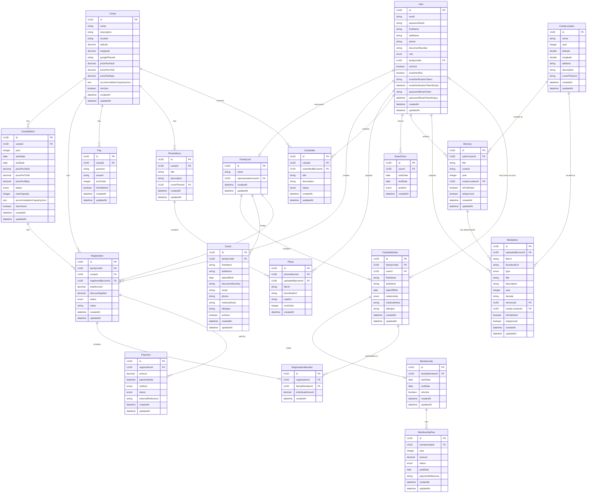

# Data Model Documentation

This document describes the data model for the ABUVI web application, optimized for LLM consumption. Each entity includes its fields, validation rules, and relationships in a single block.

## Entities

### User

Represents a platform account for accessing the application. Each user is a member (socio/a) of the association with a specific role.

**Fields:**

- `id`: Unique identifier for the User entity (Primary Key, UUID)
- `email`: User login email (required, unique, max 255 characters, valid email format)
- `passwordHash`: Hashed password for authentication (required)
- `firstName`: User first name (required, max 100 characters)
- `lastName`: User last name (required, max 100 characters)
- `phone`: Contact phone number (optional, max 20 characters, E.164 format)
- `documentNumber`: National ID/passport number (optional, max 50 characters, unique when not null, uppercase alphanumeric)
- `role`: User role in the system (required, enum: `Admin` | `Board` | `Member`, default: `Member`)
- `familyUnitId`: Reference to the FamilyUnit this user represents (optional, FK -> FamilyUnit)
- `isActive`: Whether the account is active (required, default: false)
- `emailVerified`: Whether the email has been verified (required, default: false)
- `emailVerificationToken`: Token for email verification (optional, max 512 characters, URL-safe base64)
- `emailVerificationTokenExpiry`: Token expiration datetime (optional, defaults to 24 hours from creation)
- `passwordResetToken`: Token for password reset (optional, max 512 characters, URL-safe base64, expires 1h)
- `passwordResetTokenExpiry`: Password reset token expiration datetime (optional, 1 hour from request creation)
- `createdAt`: Record creation timestamp (required, auto-generated)
- `updatedAt`: Last update timestamp (required, auto-updated)

**Validation rules:**

- Email must be unique across all users
- DocumentNumber must be unique across all users when provided (partial unique index)
- DocumentNumber format: uppercase letters and numbers only (e.g., "12345678A", "AB123456")
- Role determines access level: Admin (full system access), Board (camp management, registration oversight, payment control), Member (basic access, family registration)
- A user with role Board must have an active BoardTerm to exercise board privileges
- If familyUnitId is set, the user must have role Member and be the representative of that family unit
- Inactive users (isActive = false) cannot log in or perform any actions
- New users start with isActive = false and emailVerified = false
- Users must verify their email before the account becomes active
- Email verification tokens expire after 24 hours
- Once email is verified, both emailVerified and isActive become true

**Relationships:**

- One User can represent zero or one FamilyUnit (via `familyUnitId`)
- One User can create many Registrations (as `registeredByUserId`)
- One User can serve in many BoardTerms
- One User can upload many Photos, Memories, MediaItems, and CampIdeas

---

### FamilyUnit

Groups people who attend camp together as a family. A User acts as the representative of their family unit.

**Fields:**

- `id`: Unique identifier for the FamilyUnit entity (Primary Key, UUID)
- `name`: Family display name, e.g. "Garcia Family" (required, max 200 characters)
- `representativeUserId`: User who manages this family unit (required, FK -> User)
- `createdAt`: Record creation timestamp (required, auto-generated)
- `updatedAt`: Last update timestamp (required, auto-updated)

**Validation rules:**

- Each FamilyUnit must have exactly one representative User
- The representative User must have an active account

**Relationships:**

- One FamilyUnit has exactly one representative User (via `representativeUserId`)
- One FamilyUnit contains many FamilyMembers
- One FamilyUnit can have many Registrations (one per camp)

---

### FamilyMember

A person (child or adult) within a family unit. In the future, a FamilyMember may gain their own User account for self-access to the platform.

**Fields:**

- `id`: Unique identifier for the FamilyMember entity (Primary Key, UUID)
- `familyUnitId`: The family unit this person belongs to (required, FK -> FamilyUnit)
- `userId`: Optional linked User account for future self-access (optional, FK -> User)
- `firstName`: Person first name (required, max 100 characters)
- `lastName`: Person last name (required, max 100 characters)
- `dateOfBirth`: Date of birth, used for camp age validation (required)
- `relationship`: Relationship type within the family unit (required, enum: `Parent` | `Child` | `Sibling` | `Spouse` | `Other`)
- `documentNumber`: National ID/passport number (optional, max 50 characters, uppercase alphanumeric, e.g., "12345678A", "ABC123")
- `email`: Email address (optional, max 255 characters, valid email format)
- `phone`: Contact phone number (optional, max 20 characters, E.164 format, e.g., "+34612345678")
- `medicalNotes`: Medical information (optional, max 2000 characters, sensitive data, must be stored encrypted at rest)
- `allergies`: Allergy information (optional, max 1000 characters, sensitive data, must be stored encrypted at rest)
- `createdAt`: Record creation timestamp (required, auto-generated)
- `updatedAt`: Last update timestamp (required, auto-updated)

**Validation rules:**

- DateOfBirth must be a valid past date
- Relationship enum now includes: Parent, Child, Sibling, Spouse, Other
- DocumentNumber format: uppercase letters and numbers only (e.g., "12345678A", "ABC123")
- Email must be a valid email format when provided
- Phone must be in E.164 format when provided (e.g., "+34612345678")
- MedicalNotes (max 2000 chars) and Allergies (max 1000 chars) must be encrypted at rest (AES-256) due to sensitive health data
- Sensitive fields (medical notes, allergies) are NEVER exposed in API responses - only boolean flags indicating presence
- A FamilyMember can only belong to one FamilyUnit

**Relationships:**

- Each FamilyMember belongs to exactly one FamilyUnit (via `familyUnitId`)
- Each FamilyMember may optionally link to one User account (via `userId`)
- One FamilyMember can appear in many RegistrationMembers (across different camps)
- One FamilyMember can have zero or one Membership

---

### Membership

Represents an active membership for a family member. Members pay annual fees and gain certain privileges (e.g., discounted camp prices).

**Fields:**

- `id`: Unique identifier for the Membership entity (Primary Key, UUID)
- `familyMemberId`: The family member who holds this membership (required, FK -> FamilyMember, unique)
- `startDate`: When the membership became active (required, TIMESTAMP). Always normalized to January 1st of the membership year (`{year}-01-01T00:00:00Z`). The API accepts `{ year: int }` and the backend normalizes it — the raw date within the year has no business meaning.
- `endDate`: When the membership ended (optional, TIMESTAMP, null if currently active)
- `isActive`: Whether the membership is currently active (required, BOOLEAN)
- `createdAt`: Record creation timestamp (required, auto-generated)
- `updatedAt`: Last update timestamp (required, auto-updated)

**Validation rules:**

- Each family member can have at most one membership record (unique constraint on `familyMemberId`)
- Membership year must be > 2000 and ≤ current calendar year (cannot pre-register future memberships)
- `startDate` is always stored as `{year}-01-01T00:00:00Z` — the service normalizes the input year to January 1st
- EndDate is only set when membership is deactivated
- A family member with an active membership cannot be deleted from the system (database constraint: Restrict delete)

**Relationships:**

- Each Membership belongs to exactly one FamilyMember (via `familyMemberId`, one-to-one)
- One Membership can have many MembershipFees (one per year)

---

### MembershipFee

Represents an annual membership fee payment for a given year.

**Fields:**

- `id`: Unique identifier for the MembershipFee entity (Primary Key, UUID)
- `membershipId`: The membership this fee belongs to (required, FK -> Membership)
- `year`: Calendar year for this fee (required, INTEGER, e.g., 2026)
- `amount`: Fee amount in euros (required, NUMERIC(10,2), >= 0)
- `status`: Payment status (required, enum: `Pending` | `Paid` | `Overdue`)
- `paidDate`: When the fee was paid (optional, TIMESTAMP, only set when status is Paid)
- `paymentReference`: External payment reference or transaction ID (optional, max 100 characters)
- `createdAt`: Record creation timestamp (required, auto-generated)
- `updatedAt`: Last update timestamp (required, auto-updated)

**Validation rules:**

- Each membership can have at most one fee per year (unique constraint on (`membershipId`, `year`))
- Amount must be >= 0 with exactly 2 decimal places
- Status enum values: Pending (waiting for payment), Paid (payment received), Overdue (payment deadline passed)
- PaidDate must be set when status changes to Paid
- Status can transition: Pending -> Paid or Pending -> Overdue
- Cannot transition from Paid back to Pending or Overdue

**Relationships:**

- Each MembershipFee belongs to exactly one Membership (via `membershipId`)
- When a Membership is deleted, all its fees are cascade deleted

---

### Guest

An external person invited by a family unit to attend a camp. Guests are not platform users and do not have their own accounts. They are managed entirely by the family unit's representative.

**Fields:**

- `id`: Unique identifier for the Guest entity (Primary Key, UUID)
- `familyUnitId`: The family unit that invited this guest (required, FK -> FamilyUnit)
- `firstName`: Guest first name (required, max 100 characters)
- `lastName`: Guest last name (required, max 100 characters)
- `dateOfBirth`: Date of birth, used for camp age validation (required)
- `documentNumber`: National ID/passport number (optional, max 50 characters, uppercase alphanumeric, e.g., "12345678A")
- `email`: Email address (optional, max 255 characters, valid email format)
- `phone`: Contact phone number (optional, max 20 characters, E.164 format, e.g., "+34612345678")
- `medicalNotes`: Medical information (optional, max 2000 characters, sensitive data, must be stored encrypted at rest)
- `allergies`: Allergy information (optional, max 1000 characters, sensitive data, must be stored encrypted at rest)
- `isActive`: Whether the guest record is active (soft delete flag, required, default: true)
- `createdAt`: Record creation timestamp (required, auto-generated)
- `updatedAt`: Last update timestamp (required, auto-updated)

**Validation rules:**

- DateOfBirth must be a valid past date
- DocumentNumber format: uppercase letters and numbers only (e.g., "12345678A", "ABC123")
- Email must be a valid email format when provided
- Phone must be in E.164 format when provided (e.g., "+34612345678")
- MedicalNotes (max 2000 chars) and Allergies (max 1000 chars) must be encrypted at rest (AES-256) due to sensitive health data
- Sensitive fields (medicalNotes, allergies) are NEVER exposed in API responses — only boolean flags (`hasMedicalNotes`, `hasAllergies`) indicate their presence
- Deletion is soft delete (isActive = false), not hard delete
- A Guest can only belong to one FamilyUnit

**Relationships:**

- Each Guest belongs to exactly one FamilyUnit (via `familyUnitId`, cascade delete on FamilyUnit deletion)

---

### Camp

A reusable camp location template that can have multiple editions per year. Extended with Google Places data when a `googlePlaceId` is provided.

**Fields:**

- `id`: Unique identifier for the Camp entity (Primary Key, UUID)
- `name`: Camp name (required, max 200 characters)
- `description`: Detailed camp description (optional)
- `location`: Free-text location description (optional, max 500 characters)
- `latitude`: Geographic latitude (optional, decimal, range: -90 to 90)
- `longitude`: Geographic longitude (optional, decimal, range: -180 to 180)
- `googlePlaceId`: Google Places ID for the location (optional, max 500 characters)
- `formattedAddress`: Full formatted address from Google Places (optional, max 500 characters)
- `streetAddress`: Street name and number from Google Places (optional, max 200 characters)
- `locality`: City/town from Google Places (optional, max 100 characters)
- `administrativeArea`: Province/region from Google Places (optional, max 100 characters)
- `postalCode`: Postal code from Google Places (optional, max 20 characters)
- `country`: Country name from Google Places (optional, max 100 characters)
- `phoneNumber`: International phone number from Google Places (optional, max 30 characters)
- `nationalPhoneNumber`: National format phone from Google Places (optional, max 30 characters)
- `websiteUrl`: Website URL from Google Places (optional, max 500 characters)
- `googleMapsUrl`: Google Maps URL for the place (optional, max 500 characters)
- `googleRating`: Google rating (optional, decimal, precision 3,1, range 1.0–5.0)
- `googleRatingCount`: Number of Google reviews (optional, integer)
- `lastGoogleSyncAt`: When Google Places data was last fetched (optional, datetime UTC)
- `businessStatus`: Google business status, e.g. `OPERATIONAL` (optional, max 50 characters)
- `placeTypes`: JSON array of Google place types, e.g. `["campground","lodging"]` (optional, max 500 characters)
- `pricePerAdult`: Pricing template for adults in euros (required, decimal, >= 0)
- `pricePerChild`: Pricing template for children in euros (required, decimal, >= 0)
- `pricePerBaby`: Pricing template for babies in euros (required, decimal, >= 0)
- `accommodationCapacityJson`: JSON-serialized `AccommodationCapacity` object describing room types and sleeping capacity (optional, stored as `text`). Use `GetAccommodationCapacity()` / `SetAccommodationCapacity()` helpers; never access the raw JSON directly.
- `province`: Province/region (optional, max 100 characters)
- `contactEmail`: Contact email address (optional, valid email format)
- `contactPerson`: Name of the contact person (optional, max 200 characters)
- `contactCompany`: Contact company name (optional, max 200 characters)
- `secondaryWebsiteUrl`: Secondary website URL (optional, max 500 characters)
- `basePrice`: Base price in euros (optional, decimal >= 0, precision 10,2)
- `vatIncluded`: Whether VAT is included in the base price (optional, boolean)
- `externalSourceId`: External source identifier for imported data (optional, max 100 characters, indexed)
- `abuviManagedByUserId`: User responsible for managing this camp within ABUVI (optional, FK -> User, must be Board or Admin role)
- `abuviContactedAt`: When ABUVI last contacted this camp (optional, max 100 characters, free-text)
- `abuviPossibility`: Assessment of partnership possibility (optional, max 100 characters)
- `abuviLastVisited`: When an ABUVI member last visited (optional, max 200 characters, free-text)
- `abuviHasDataErrors`: Whether the camp's data has known errors (optional, boolean)
- `lastModifiedByUserId`: User who last modified this camp (optional, FK -> User)
- `isActive`: Whether the camp is active (required, default: true)
- `createdAt`: Record creation timestamp (required, auto-generated)
- `updatedAt`: Last update timestamp (required, auto-updated)

**Computed (not stored):**

- `calculatedTotalBedCapacity`: Derived from `AccommodationCapacity.CalculateTotalBedCapacity()`; included in API responses when `accommodationCapacityJson` is not null.

**Validation rules:**

- Latitude, when provided, must be between -90 and 90
- Longitude, when provided, must be between -180 and 180
- All prices must be >= 0
- `basePrice`, when provided, must be >= 0
- `contactEmail`, when provided, must be a valid email address
- `abuviManagedByUserId`, when provided, must reference a user with Board or Admin role (throws `BusinessRuleException` otherwise)
- When `googlePlaceId` is provided at creation, the backend auto-enriches all Google Places fields
- `accommodationCapacityJson` stores camelCase JSON; all numeric accommodation fields must be >= 0

**Audit tracking:**

- 9 fields are automatically tracked for changes: `BasePrice`, `VatIncluded`, `AbuviPossibility`, `AbuviLastVisited`, `AbuviContactedAt`, `AbuviManagedByUserId`, `IsActive`, `ContactPerson`, `ContactEmail`
- Changes are recorded in the `CampAuditLog` entity with old/new values and the user who made the change

**Relationships:**

- One Camp can have many CampEditions
- One Camp can have many CampPhotos (cascade delete)
- One Camp can have many CampObservations (cascade delete)
- One Camp can have many CampAuditLogs (cascade delete)
- One Camp can have many Registrations
- One Camp can have many Faqs (camp-specific FAQs)
- One Camp can have many PhotoAlbums
- One Camp can have many CampIdeas
- One Camp can optionally reference a User as `AbuviManagedByUser` (FK, set null on delete)

---

### CampPhoto

A photo associated with a camp. Supports both Google Places-sourced photos (`isOriginal = true`) and manually managed photos added by Admin/Board users (`isOriginal = false`).

**Fields:**

- `id`: Unique identifier (Primary Key, UUID)
- `campId`: The camp this photo belongs to (required, FK -> Camp, cascade delete)
- `photoReference`: Google Places photo reference token (optional, max 500 characters; only set for Google Places photos)
- `photoUrl`: Direct URL to the photo image (optional, max 1000 characters). For Google Places photos: currently null (Phase 1). For manually managed photos: the URL provided by the admin/board (max 2000 characters in API input, stored max 1000).
- `description`: Optional caption or description for the photo (optional, max 500 characters)
- `width`: Photo width in pixels (optional, integer; only populated for Google Places photos)
- `height`: Photo height in pixels (optional, integer; only populated for Google Places photos)
- `attributionName`: Photo author name (optional, max 200 characters; required by Google T&C for Google Places photos, not applicable to manually managed photos)
- `attributionUrl`: Author profile URL (optional, max 500 characters; Google Places photos only)
- `isOriginal`: Whether the photo came from Google Places (`true`) or was manually added by an admin/board user (`false`). Required, default: `true`.
- `isPrimary`: Whether this is the primary display photo for the camp (required, default: false). Only one photo per camp may have `isPrimary = true` at a time.
- `displayOrder`: Sort order in the gallery, 0-based (required, integer >= 0, default: 0)
- `createdAt`: Record creation timestamp (required, auto-generated)
- `updatedAt`: Last update timestamp (required, auto-updated)

**Validation rules:**

- Attribution information must always be displayed for Google Places photos (`isOriginal = true`) per Google T&C
- Only one `isPrimary = true` photo is allowed per camp; setting a new primary clears the previous one
- For manually managed photos: `photoUrl` is required and must be a valid URL (max 2000 characters in requests)
- `displayOrder` must be >= 0
- `description` max 500 characters when provided

**Relationships:**

- Each CampPhoto belongs to one Camp (via `campId`); deleted when the camp is deleted (cascade)

---

### CampObservation

An append-only note attached to a camp by a Board or Admin user. Used for internal observations about the camp location.

**Table:** `camp_observations`

**Fields:**

- `id`: Unique identifier (Primary Key, UUID)
- `campId`: The camp this observation belongs to (required, FK -> Camp, cascade delete, indexed)
- `text`: Observation text content (required, max 4000 characters)
- `season`: Season or time context for the observation (optional, max 20 characters)
- `createdByUserId`: User who created this observation (required, UUID)
- `createdAt`: Record creation timestamp (required, auto-generated, default: `NOW()`)

**Validation rules:**

- `text` is required and cannot exceed 4000 characters
- `season`, when provided, cannot exceed 20 characters

**Relationships:**

- Each CampObservation belongs to one Camp (via `campId`); deleted when the camp is deleted (cascade)

**API endpoints:**

- `POST /api/camps/{campId}/observations` — Add an observation (Board+ only)
- `GET /api/camps/{campId}/observations` — List observations ordered by `createdAt DESC` (Board+ only)

---

### CampAuditLog

Automatic field-level change tracking for specific Camp fields. Recorded whenever a tracked field changes via `PUT /api/camps/{id}`.

**Table:** `camp_audit_logs`

**Fields:**

- `id`: Unique identifier (Primary Key, UUID)
- `campId`: The camp this audit entry belongs to (required, FK -> Camp, cascade delete, indexed)
- `fieldName`: Name of the field that changed (required, max 100 characters)
- `oldValue`: Previous value as string (optional, max 500 characters)
- `newValue`: New value as string (optional, max 500 characters)
- `changedByUserId`: User who made the change (required, UUID)
- `changedAt`: When the change occurred (required, auto-generated, default: `NOW()`)

**Indexes:**

- `camp_id` (single column)
- `(camp_id, changed_at)` (composite, for efficient querying)

**Tracked fields:**

- `BasePrice`, `VatIncluded`, `AbuviPossibility`, `AbuviLastVisited`, `AbuviContactedAt`, `AbuviManagedByUserId`, `IsActive`, `ContactPerson`, `ContactEmail`

**Relationships:**

- Each CampAuditLog belongs to one Camp (via `campId`); deleted when the camp is deleted (cascade)

**API endpoints:**

- `GET /api/camps/{campId}/audit-log` — Get audit log ordered by `changedAt DESC` (Admin only)

---

### AccommodationCapacity

A value object (not a separate database table) serialized as JSON inside `Camp.accommodationCapacityJson` and `CampEdition.accommodationCapacityJson`. Describes the sleeping and accommodation infrastructure of a camp location.

**Fields (all optional):**

- `privateRoomsWithBathroom`: Number of private rooms with en-suite bathroom (integer >= 0)
- `privateRoomsSharedBathroom`: Number of private rooms sharing a bathroom (integer >= 0)
- `sharedRooms`: Array of `SharedRoomInfo` objects describing shared dormitory-style rooms (optional array)
- `bungalows`: Number of bungalows or cabins (integer >= 0)
- `campOwnedTents`: Number of tents provided by the camp (integer >= 0)
- `memberTentAreaSquareMeters`: Available area in m² for member-brought tents (integer >= 0)
- `memberTentCapacityEstimate`: Estimated number of people that can fit in the member tent area (integer >= 0)
- `motorhomeSpots`: Number of motorhome/caravan pitches (integer >= 0)
- `totalCapacity`: Total person capacity of the camp (integer >= 0, optional)
- `roomsDescription`: Free-text description of rooms (optional string)
- `bungalowsDescription`: Free-text description of bungalows (optional string)
- `tentsDescription`: Free-text description of tents provided by the camp (optional string)
- `tentAreaDescription`: Free-text description of the tent area for member tents (optional string)
- `parkingSpots`: Number of parking spots available (integer >= 0, optional)
- `hasAdaptedMenu`: Whether the camp offers adapted/special dietary menus (optional boolean)
- `hasEnclosedDiningRoom`: Whether the camp has an enclosed dining room (optional boolean)
- `hasSwimmingPool`: Whether the camp has a swimming pool (optional boolean)
- `hasSportsCourt`: Whether the camp has a sports court (optional boolean)
- `hasForestArea`: Whether the camp has a forest/wooded area (optional boolean)
- `notes`: Free-text notes about accommodation (optional string)

**SharedRoomInfo fields:**

- `quantity`: Number of rooms of this type (required, integer > 0)
- `bedsPerRoom`: Number of beds in each room (required, integer > 0)
- `hasBathroom`: Whether rooms of this type have an en-suite bathroom (required, boolean)
- `hasShower`: Whether rooms of this type have an en-suite shower (required, boolean)
- `notes`: Optional description of this room type (optional string)

**Computed:**

- `CalculateTotalBedCapacity()`: Returns `(privateRoomsWithBathroom * 2) + (privateRoomsSharedBathroom * 2) + sum(sharedRooms[i].quantity * sharedRooms[i].bedsPerRoom)`. Bungalows, tents, and motorhome spots are excluded from the bed count.

**Storage:**

- Stored as camelCase JSON text in `accommodation_capacity_json` columns on `camps` and `camp_editions` tables.
- Null fields are omitted from the serialized JSON.
- Access via `Camp.GetAccommodationCapacity()` / `Camp.SetAccommodationCapacity()` helper methods.

**Auto-sync behavior:**

- When `accommodationCapacity` is set on a `CampEdition` via `POST /api/camps/editions/propose`, the parent `Camp.accommodationCapacityJson` is automatically synced in the same transaction.
- When a `CampEdition` is promoted to `Draft` status and it has an accommodation capacity, the parent `Camp` is also updated.

---

### CampEdition

A specific annual edition of a camp (e.g., Camp 2026). Defines dates, pricing, capacity, and status for a single year's camp event. One `Camp` can have many `CampEdition` records across years.

**Fields:**

- `id`: Unique identifier (Primary Key, UUID)
- `campId`: The camp location template this edition belongs to (required, FK -> Camp)
- `year`: The calendar year of this camp edition (required, integer, e.g., 2026)
- `startDate`: Edition start date (required, datetime UTC)
- `endDate`: Edition end date (required, datetime UTC)
- `pricePerAdult`: Price per adult in euros for this edition (required, decimal, >= 0)
- `pricePerChild`: Price per child in euros for this edition (required, decimal, >= 0)
- `pricePerBaby`: Price per baby in euros for this edition (required, decimal, >= 0)
- `useCustomAgeRanges`: Whether this edition overrides the default age range thresholds (required, boolean, default: false)
- `customBabyMaxAge`: Custom maximum age (inclusive) to be priced as baby (optional, integer; only used when `useCustomAgeRanges = true`)
- `customChildMinAge`: Custom minimum age (inclusive) to be priced as child (optional, integer)
- `customChildMaxAge`: Custom maximum age (inclusive) to be priced as child (optional, integer)
- `customAdultMinAge`: Custom minimum age (inclusive) to be priced as adult (optional, integer)
- `status`: Current lifecycle status (required, enum: `Proposed` | `Draft` | `Open` | `Closed` | `Completed`, default: `Proposed`)
- `maxCapacity`: Maximum number of participants for this edition (required, integer > 0)
- `notes`: Free-text notes for internal use (optional, max 2000 characters)
- `description`: Long-form public-facing description for the edition — activities overview, highlights, marketing copy, etc. (optional, PostgreSQL `text`, unlimited length)
- `isArchived`: Whether the edition has been rejected/archived (required, boolean, default: false)
- `accommodationCapacityJson`: JSON-serialized `AccommodationCapacity` for this specific edition (optional, stored as `text`). When set, auto-syncs to parent `Camp.accommodationCapacityJson`.
- `proposalReason`: Reason provided when proposing the edition (optional, used in Proposed → Draft flow)
- `proposalNotes`: Additional notes provided at proposal time (optional)
- `contactEmail`: Contact email for this edition (optional)
- `contactPhone`: Contact phone for this edition (optional)
- `createdAt`: Record creation timestamp (required, auto-generated)
- `updatedAt`: Last update timestamp (required, auto-updated)

**Computed (not stored):**

- `calculatedTotalBedCapacity`: Derived from the edition's `AccommodationCapacity.CalculateTotalBedCapacity()` when `accommodationCapacityJson` is not null.
- `registrationCount`: Count of confirmed registrations for this edition (computed on query).
- `availableSpots`: `maxCapacity - registrationCount` (computed on query).

**Validation rules:**

- `endDate` must be after `startDate`
- All prices must be >= 0
- Status transitions follow a strict chain: `Proposed → Draft → Open → Closed → Completed`; rejection sets `isArchived = true` (soft delete)
- `Draft → Open`: `startDate` must not be in the past
- `Closed → Completed`: `endDate` must be in the past
- `Open` and `Closed` editions cannot have their dates or prices changed; only `notes`, `description`, and `maxCapacity` are editable

**Relationships:**

- Each CampEdition belongs to one Camp (via `campId`)
- One CampEdition can have many CampEditionAccommodations

---

### CampEditionAccommodation

An accommodation option available for a specific camp edition (lodge, caravan, tent, etc.). Families rank up to 3 preferences during registration. This is a preference-only system — accommodations have no price; capacity is informational only.

**Fields:**

- `id`: Unique identifier (Primary Key, UUID)
- `campEditionId`: The camp edition this accommodation belongs to (required, FK -> CampEdition)
- `name`: Display name (required, max 200 characters, e.g. "Refugio Norte", "Parcela Caravanas A")
- `accommodationType`: Type of accommodation (required, enum: `Lodge` | `Caravan` | `Tent` | `Bungalow` | `Motorhome`)
- `description`: Optional description (max 1000 characters)
- `capacity`: Maximum capacity in persons/units (optional, integer > 0 when set; informational only)
- `isActive`: Whether the option is available for selection (required, default: true)
- `sortOrder`: Display order (required, integer >= 0, default: 0)
- `createdAt`: Record creation timestamp (required, auto-generated)
- `updatedAt`: Last update timestamp (required, auto-updated)

**Validation rules:**

- Name is required, max 200 characters
- AccommodationType must be a valid enum value
- Capacity must be > 0 when provided
- SortOrder must be >= 0
- Cannot delete if any RegistrationAccommodationPreference references this accommodation (deactivate instead)

**Relationships:**

- Each CampEditionAccommodation belongs to one CampEdition (via `campEditionId`, CASCADE delete)
- One CampEditionAccommodation can be referenced by many RegistrationAccommodationPreferences

---

### Registration

A family's registration to a specific camp. One registration per family per camp, containing the list of family members attending.

**Fields:**

- `id`: Unique identifier for the Registration entity (Primary Key, UUID)
- `familyUnitId`: The family being registered (required, FK -> FamilyUnit)
- `campId`: The camp being registered for (required, FK -> Camp)
- `registeredByUserId`: User who created the registration (required, FK -> User)
- `totalAmount`: Calculated total amount for all members in euros (required, decimal, >= 0)
- `status`: Current registration status (required, enum: `Pending` | `Confirmed` | `Cancelled`)
- `notes`: Additional notes from the registering user (optional, max 1000 characters)
- `createdAt`: Record creation timestamp (required, auto-generated)
- `updatedAt`: Last update timestamp (required, auto-updated)

**Validation rules:**

- Unique constraint on (familyUnitId, campId): one registration per family per camp
- TotalAmount is calculated as the sum of all RegistrationMember.individualAmount
- Status transitions: Pending -> Confirmed (when fully paid) or Pending -> Cancelled. Confirmed -> Cancelled is also allowed
- Camp must have status Open to accept new registrations

**Relationships:**

- Each Registration belongs to one FamilyUnit (via `familyUnitId`)
- Each Registration belongs to one Camp (via `campId`)
- Each Registration is created by one User (via `registeredByUserId`)
- One Registration includes many RegistrationMembers (at least one)
- One Registration can have many Payments (partial or full)

---

### RegistrationMember

Links specific family members to a registration. Tracks which members of a family are attending a specific camp and their individual cost.

**Fields:**

- `id`: Unique identifier for the RegistrationMember entity (Primary Key, UUID)
- `registrationId`: The registration this belongs to (required, FK -> Registration)
- `familyMemberId`: The family member being registered (required, FK -> FamilyMember)
- `individualAmount`: Calculated amount for this member in euros (required, decimal, >= 0)
- `createdAt`: Record creation timestamp (required, auto-generated)

**Validation rules:**

- Unique constraint on (registrationId, familyMemberId): each family member can only appear once per registration
- The FamilyMember must belong to the same FamilyUnit as the Registration
- The FamilyMember's age (calculated from dateOfBirth at camp startDate) must be between Camp.minAge and Camp.maxAge
- The total count of RegistrationMembers across all Registrations for a Camp must not exceed Camp.maxCapacity

**Relationships:**

- Each RegistrationMember belongs to one Registration (via `registrationId`)
- Each RegistrationMember references one FamilyMember (via `familyMemberId`)

---

### Payment

A partial or full payment for a registration. Supports multiple payments per registration (deposit + remaining balance).

**Fields:**

- `id`: Unique identifier for the Payment entity (Primary Key, UUID)
- `registrationId`: The registration being paid for (required, FK -> Registration)
- `amount`: Payment amount in euros (required, decimal, > 0)
- `paymentDate`: When the payment was made (required, datetime)
- `method`: Payment method used (required, enum: `Card` | `Transfer` | `Cash`)
- `status`: Current payment status (required, enum: `Pending` | `Completed` | `Failed` | `Refunded`)
- `externalReference`: Payment gateway transaction ID, e.g. Redsys reference (optional, max 255 characters)
- `createdAt`: Record creation timestamp (required, auto-generated)
- `updatedAt`: Last update timestamp (required, auto-updated)

**Validation rules:**

- Amount must be greater than 0
- The sum of all Completed payments for a Registration must not exceed Registration.totalAmount
- When the sum of Completed payments equals Registration.totalAmount, the Registration status should transition to Confirmed
- ExternalReference is required when method is Card (payment gateway integration)

**Relationships:**

- Each Payment belongs to one Registration (via `registrationId`)

---

### RegistrationAccommodationPreference

A family's ranked accommodation preference for a registration (1st, 2nd, or 3rd choice). Up to 3 preferences per registration, each pointing to a different CampEditionAccommodation.

**Fields:**

- `id`: Unique identifier (Primary Key, UUID, default: `gen_random_uuid()`)
- `registrationId`: The registration this preference belongs to (required, FK -> Registration)
- `campEditionAccommodationId`: The accommodation option being ranked (required, FK -> CampEditionAccommodation)
- `preferenceOrder`: Rank position (required, integer, 1-3)
- `createdAt`: Record creation timestamp (required, auto-generated)

**Validation rules:**

- PreferenceOrder must be between 1 and 3 (inclusive)
- A registration can have at most 3 preferences
- No duplicate CampEditionAccommodationId per registration (unique index)
- No duplicate PreferenceOrder per registration (unique index)
- Each referenced accommodation must belong to the same camp edition as the registration
- Each referenced accommodation must be active

**Relationships:**

- Each RegistrationAccommodationPreference belongs to one Registration (via `registrationId`, CASCADE delete)
- Each RegistrationAccommodationPreference references one CampEditionAccommodation (via `campEditionAccommodationId`, RESTRICT delete)

---

### Faq

Dynamic FAQ entry, optionally linked to a specific camp or general to the association.

**Fields:**

- `id`: Unique identifier for the Faq entity (Primary Key, UUID)
- `campId`: Linked camp for camp-specific FAQs (optional, FK -> Camp. When null, the FAQ applies to the association in general)
- `question`: The question text (required, max 500 characters)
- `answer`: The answer text (required, rich text)
- `sortOrder`: Display order, lower numbers appear first (required, integer, >= 0)
- `isPublished`: Whether the FAQ is visible to users (required, default: false)
- `createdAt`: Record creation timestamp (required, auto-generated)
- `updatedAt`: Last update timestamp (required, auto-updated)

**Validation rules:**

- SortOrder must be >= 0
- Only published FAQs (isPublished = true) are shown to regular users
- FAQs can only be created/edited by users with Admin or Board role

**Relationships:**

- Each Faq optionally belongs to one Camp (via `campId`). When campId is null, it is a general association FAQ

---

### BoardTerm

Tracks board (Junta) membership periods. Board members are elected in assembly for 2-year terms and have elevated privileges in the system.

**Fields:**

- `id`: Unique identifier for the BoardTerm entity (Primary Key, UUID)
- `userId`: The user serving on the board (required, FK -> User)
- `startDate`: Term start date (required)
- `endDate`: Term end date (required)
- `position`: Board position held (required, enum: `President` | `Secretary` | `Treasurer` | `Member`)
- `createdAt`: Record creation timestamp (required, auto-generated)

**Validation rules:**

- EndDate must be after StartDate
- A User should not have overlapping BoardTerms for the same position
- Board terms are typically 2 years but the system does not enforce a fixed duration

**Relationships:**

- Each BoardTerm belongs to one User (via `userId`)

---

### PhotoAlbum

A photo album associated with a specific camp edition. Part of the private area accessible to members.

**Fields:**

- `id`: Unique identifier for the PhotoAlbum entity (Primary Key, UUID)
- `campId`: The camp this album belongs to (required, FK -> Camp)
- `title`: Album title (required, max 200 characters)
- `description`: Album description (optional, max 500 characters)
- `coverPhotoId`: Photo used as album cover (optional, FK -> Photo)
- `createdAt`: Record creation timestamp (required, auto-generated)
- `updatedAt`: Last update timestamp (required, auto-updated)

**Validation rules:**

- CoverPhotoId, when set, must reference a Photo that belongs to this same album
- Albums can only be created by users with Admin or Board role

**Relationships:**

- Each PhotoAlbum belongs to one Camp (via `campId`)
- One PhotoAlbum contains many Photos
- One PhotoAlbum optionally references one Photo as cover (via `coverPhotoId`)

---

### Photo

An individual photo within a camp photo album.

**Fields:**

- `id`: Unique identifier for the Photo entity (Primary Key, UUID)
- `photoAlbumId`: The album this photo belongs to (required, FK -> PhotoAlbum)
- `uploadedByUserId`: User who uploaded the photo (required, FK -> User)
- `fileUrl`: URL to the full-size image in blob storage (required, max 2048 characters)
- `thumbnailUrl`: URL to the thumbnail image in blob storage (required, max 2048 characters)
- `caption`: Photo caption (optional, max 500 characters)
- `sortOrder`: Display order within the album (optional, integer, >= 0)
- `createdAt`: Record creation timestamp (required, auto-generated)

**Validation rules:**

- FileUrl and ThumbnailUrl must be valid URLs pointing to blob storage
- Thumbnails should be auto-generated from the original image on upload

**Relationships:**

- Each Photo belongs to one PhotoAlbum (via `photoAlbumId`)
- Each Photo is uploaded by one User (via `uploadedByUserId`)

---

### CampIdea

An idea or suggestion submitted by a member before a camp. Used to collect input from members for camp planning.

**Fields:**

- `id`: Unique identifier for the CampIdea entity (Primary Key, UUID)
- `campId`: The camp this idea is for (required, FK -> Camp)
- `submittedByUserId`: User who submitted the idea (required, FK -> User)
- `title`: Idea title (required, max 200 characters)
- `description`: Idea description (required, max 2000 characters)
- `status`: Current idea status (required, enum: `Submitted` | `Reviewed` | `Accepted` | `Rejected`)
- `createdAt`: Record creation timestamp (required, auto-generated)
- `updatedAt`: Last update timestamp (required, auto-updated)

**Validation rules:**

- Any authenticated user can submit ideas (status starts as Submitted)
- Only Admin or Board users can change the status to Reviewed, Accepted, or Rejected
- Status transitions: Submitted -> Reviewed -> Accepted or Reviewed -> Rejected

**Relationships:**

- Each CampIdea belongs to one Camp (via `campId`)
- Each CampIdea is submitted by one User (via `submittedByUserId`)

---

### Memory

A story, anecdote, or memory contributed to the permanent historical archive. Part of the collaborative diary and the space for personal contributions.

**Fields:**

- `id`: Unique identifier for the Memory entity (Primary Key, UUID)
- `authorUserId`: User who wrote the memory (required, FK -> User)
- `title`: Memory title (required, max 200 characters)
- `content`: Memory content (required, rich text)
- `year`: Approximate year of the memory (optional, integer, e.g. 1985)
- `campLocationId`: Optional link to a historical camp location (optional, FK -> CampLocation)
- `isPublished`: Whether the memory is visible to all users (required, default: false)
- `isApproved`: Whether the memory has been approved by board/admin (required, default: false)
- `createdAt`: Record creation timestamp (required, auto-generated)
- `updatedAt`: Last update timestamp (required, auto-updated)

**Validation rules:**

- Any authenticated user can create a Memory
- Memories require approval (isApproved = true) by Admin or Board before becoming visible
- A Memory is only visible when both isApproved = true AND isPublished = true
- Year, when provided, must be a reasonable past year (e.g. >= 1975, the association's founding)

**Relationships:**

- Each Memory is authored by one User (via `authorUserId`)
- Each Memory optionally links to one CampLocation (via `campLocationId`)
- One Memory can have many MediaItems attached to it

---

### MediaItem

Multimedia content (photos, videos, interviews, documents) for the historical archive. Supports the multimedia gallery and can be attached to Memories.

**Fields:**

- `id`: Unique identifier for the MediaItem entity (Primary Key, UUID)
- `uploadedByUserId`: User who uploaded the content (required, FK -> User)
- `fileUrl`: URL to the file in blob storage (required, max 2048 characters)
- `thumbnailUrl`: URL to the thumbnail for photos/videos (optional, max 2048 characters)
- `type`: Type of media content (required, enum: `Photo` | `Video` | `Interview` | `Document`)
- `title`: Content title (required, max 200 characters)
- `description`: Content description (optional, max 1000 characters)
- `year`: Year of the content (optional, integer)
- `decade`: Decade for filtering, e.g. "70s", "80s", "90s", "00s", "10s", "20s" (optional, max 10 characters)
- `memoryId`: Optional link to a Memory entry (optional, FK -> Memory)
- `campLocationId`: Optional link to a camp location (optional, FK -> CampLocation)
- `isPublished`: Whether the item is visible to all users (required, default: false)
- `isApproved`: Whether the item has been approved by board/admin (required, default: false)
- `createdAt`: Record creation timestamp (required, auto-generated)
- `updatedAt`: Last update timestamp (required, auto-updated)

**Validation rules:**

- ThumbnailUrl is required when type is Photo or Video
- Decade should be auto-derived from year when year is provided
- MediaItems require approval (isApproved = true) by Admin or Board before becoming visible
- A MediaItem is only visible when both isApproved = true AND isPublished = true
- FileUrl must point to a valid blob storage location

**Relationships:**

- Each MediaItem is uploaded by one User (via `uploadedByUserId`)
- Each MediaItem optionally belongs to one Memory (via `memoryId`)
- Each MediaItem optionally links to one CampLocation (via `campLocationId`)

---

### CampLocation

A historical camp location for the interactive map. Each record represents a specific place where a camp was held in a given year.

**Fields:**

- `id`: Unique identifier for the CampLocation entity (Primary Key, UUID)
- `name`: Location name (required, max 200 characters)
- `year`: Year the camp was held at this location (required, integer)
- `latitude`: Geographic latitude (required, double, range: -90 to 90)
- `longitude`: Geographic longitude (required, double, range: -180 to 180)
- `address`: Full address (optional, max 500 characters)
- `description`: Location description (optional, max 1000 characters)
- `coverPhotoUrl`: Representative photo URL in blob storage (optional, max 2048 characters)
- `createdAt`: Record creation timestamp (required, auto-generated)
- `updatedAt`: Last update timestamp (required, auto-updated)

**Validation rules:**

- Latitude must be between -90 and 90
- Longitude must be between -180 and 180
- Year must be a valid past year (>= 1975, the association's founding)
- CampLocations can only be created/edited by users with Admin or Board role

**Relationships:**

- One CampLocation can be referenced by many Memories (via Memory.campLocationId)
- One CampLocation can be referenced by many MediaItems (via MediaItem.campLocationId)

## Membership

Represents an active membership for a family member. Members pay annual fees and gain certain privileges (e.g., discounted camp prices).

**Fields:**

- `id`: Unique identifier for the Membership entity (Primary Key, UUID)
- `familyMemberId`: The family member who holds this membership (required, FK -> FamilyMember, unique)
- `startDate`: When the membership became active (required, TIMESTAMP)
- `endDate`: When the membership ended (optional, TIMESTAMP, null if currently active)
- `isActive`: Whether the membership is currently active (required, BOOLEAN)
- `createdAt`: Record creation timestamp (required, auto-generated)
- `updatedAt`: Last update timestamp (required, auto-updated)

**Validation rules:**

- Each family member can have at most one membership record (unique constraint on `familyMemberId`)
- StartDate must not be in the future
- EndDate is only set when membership is deactivated
- A family member with an active membership cannot be deleted from the system (database constraint: Restrict delete)

**Relationships:**

- Each Membership belongs to exactly one FamilyMember (via `familyMemberId`, one-to-one)
- One Membership can have many MembershipFees (one per year)

---

### MembershipFee

Represents an annual membership fee payment for a given year.

**Fields:**

- `id`: Unique identifier for the MembershipFee entity (Primary Key, UUID)
- `membershipId`: The membership this fee belongs to (required, FK -> Membership)
- `year`: Calendar year for this fee (required, INTEGER, e.g., 2026)
- `amount`: Fee amount in euros (required, NUMERIC(10,2), >= 0)
- `status`: Payment status (required, enum: `Pending` | `Paid` | `Overdue`)
- `paidDate`: When the fee was paid (optional, TIMESTAMP, only set when status is Paid)
- `paymentReference`: External payment reference or transaction ID (optional, max 100 characters)
- `createdAt`: Record creation timestamp (required, auto-generated)
- `updatedAt`: Last update timestamp (required, auto-updated)

**Validation rules:**

- Each membership can have at most one fee per year (unique constraint on (`membershipId`, `year`))
- Amount must be >= 0 with exactly 2 decimal places
- Status enum values: Pending (waiting for payment), Paid (payment received), Overdue (payment deadline passed)
- PaidDate must be set when status changes to Paid
- Status can transition: Pending -> Paid or Pending -> Overdue
- Cannot transition from Paid back to Pending or Overdue

**Relationships:**

- Each MembershipFee belongs to exactly one Membership (via `membershipId`)
- When a Membership is deleted, all its fees are cascade deleted

## Entity-Relationship Diagram

## Design Notes

- All `id` fields are UUIDs as primary keys
- All monetary fields use `decimal` type for precision (never `float`)
- Sensitive fields (medicalNotes, allergies) must be encrypted at rest
- The registration process is a multi-step workflow that may require a state machine to manage status transitions (Pending -> Confirmed -> Cancelled)
- The sum of Completed payments determines when a Registration transitions to Confirmed
- Historical archive content (Memory, MediaItem) requires board/admin approval before publication
- Field names use camelCase convention aligned with the project's JS/TS frontend standards
