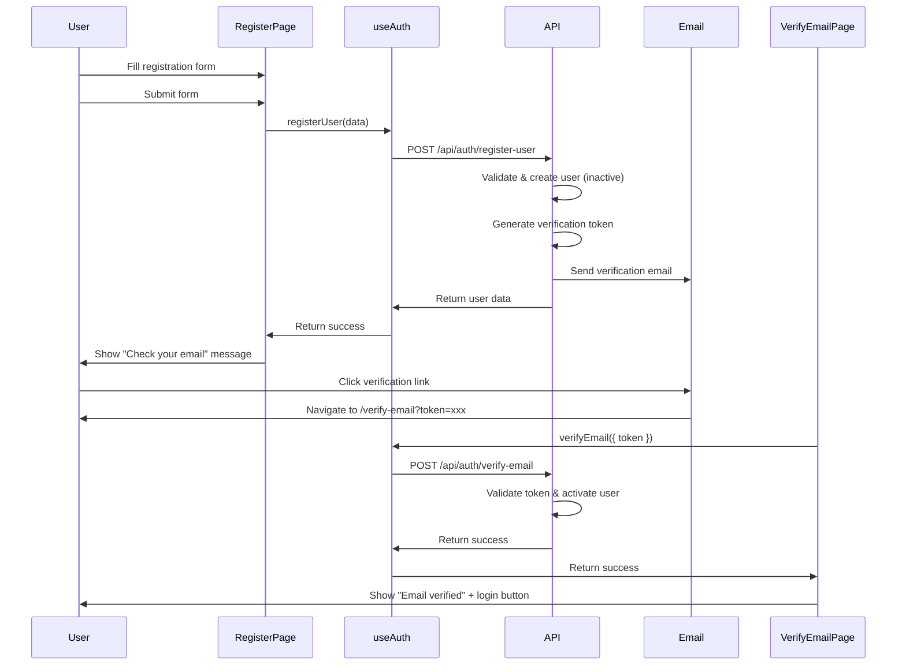

# Development Guide

This guide provides step-by-step instructions for setting up the development environment, running the application, and executing tests for the ABUVI web platform.

## Prerequisites

Ensure you have the following installed:

- **.NET 9 SDK** ([download](https://dotnet.microsoft.com/download/dotnet/9.0))
- **Node.js** (v20 or higher) and **npm** (v10 or higher)
- **Docker** and **Docker Compose**
- **Git**
- **Python 3.12** (for CSnakes integration)
- **EF Core Tools** (`dotnet tool install --global dotnet-ef`)

## 1. Clone the Repository

```bash
git clone <repository-url>
cd abuvi-app
```

## 2. Infrastructure Setup (Docker)

Start PostgreSQL and supporting services with Docker Compose:

```bash
# Start all containers (PostgreSQL, pgAdmin, MinIO)
docker-compose up -d

# Verify containers are running
docker-compose ps
```

Services available after startup:

| Service | URL / Connection | Credentials |
|---------|-----------------|-------------|
| **PostgreSQL 16** | `localhost:5432` | See `docker-compose.yml` |
| **pgAdmin 4** | `http://localhost:5050` | See `docker-compose.yml` |
| **MinIO** (S3-compatible storage) | `http://localhost:9000` | See `docker-compose.yml` |

## 3. Backend Setup (.NET 9)

### Environment Configuration

Configure local secrets using .NET User Secrets (never commit credentials):

```bash
cd src/Abuvi.API

# Initialize user secrets
dotnet user-secrets init

# Set connection string
dotnet user-secrets set "ConnectionStrings:DefaultConnection" "Host=localhost;Port=5432;Database=AbuviDb;Username=abuvi_user;Password=your_password"

# Set Redsys keys (if testing payments)
dotnet user-secrets set "Redsys:SecretKey" "your_redsys_test_key"
dotnet user-secrets set "Redsys:MerchantCode" "your_merchant_code"
```

### Install Dependencies and Build

```bash
# From project root
dotnet restore
dotnet build
```

### Database Setup

```bash
# Apply EF Core migrations to create/update the database schema
dotnet ef database update --project src/Abuvi.API

# (Optional) Verify migrations status
dotnet ef migrations list --project src/Abuvi.API
```

### Run the Backend

```bash
dotnet run --project src/Abuvi.API
```

The backend API will be available at `http://localhost:5000`. Swagger/OpenAPI documentation is available at `http://localhost:5000/swagger`.

## 4. Frontend Setup (Vue 3)

```bash
# Navigate to frontend directory
cd frontend

# Install dependencies
npm install

# Start the development server with HMR
npm run dev
```

The frontend application will be available at `http://localhost:5173`.

### Environment Configuration

Create a `.env.development` file in the `frontend/` directory:

```env
VITE_API_URL=http://localhost:5000/api
VITE_APP_TITLE=ABUVI - Development
```

## 5. Python Setup (CSnakes)

For data analysis features that use Python via CSnakes:

```bash
# Navigate to analysis directory
cd src/Abuvi.Analysis

# Create a virtual environment
python -m venv .venv

# Activate the virtual environment
# On Windows:
.venv\Scripts\activate
# On macOS/Linux:
source .venv/bin/activate

# Install Python dependencies
pip install -r requirements.txt
```

## Running Tests

### Backend Tests

```bash
# Run all tests
dotnet test

# Run tests with coverage
dotnet test --collect:"XPlat Code Coverage"

# Run tests for a specific project
dotnet test src/Abuvi.Tests
```

### Frontend Tests

```bash
cd frontend

# Run unit and component tests with Vitest
npx vitest

# Run tests in watch mode
npx vitest --watch

# Run tests with coverage
npx vitest --coverage

# Open Cypress E2E test runner (interactive)
npx cypress open

# Run Cypress E2E tests headlessly
npx cypress run
```

## Common Tasks

### Creating a New EF Core Migration

```bash
# After modifying entity configurations
dotnet ef migrations add DescriptiveMigrationName --project src/Abuvi.API

# Review the generated migration file before applying
# Then apply it
dotnet ef database update --project src/Abuvi.API
```

### Resetting the Database

```bash
# Drop and recreate the database
dotnet ef database drop --project src/Abuvi.API --force
dotnet ef database update --project src/Abuvi.API
```

### Adding a New Feature (Vertical Slice)

Create the following files in `src/Abuvi.API/Features/[FeatureName]/`:

1. `[Feature]Endpoints.cs` - Minimal API endpoint definitions
2. `[Feature]Models.cs` - Request/Response DTOs and domain entity
3. `[Feature]Service.cs` - Business logic
4. `[Feature]Repository.cs` - Data access interface and implementation
5. `[Feature]Validator.cs` - FluentValidation rules (if needed)

Register the endpoints in `Program.cs`:

```csharp
app.Map[Feature]Endpoints();
```

Register services in `Program.cs`:

```csharp
builder.Services.AddScoped<I[Feature]Repository, [Feature]Repository>();
builder.Services.AddScoped<[Feature]Service>();
```

### Building for Production

```bash
# Backend
dotnet publish src/Abuvi.API -c Release -o publish/

# Frontend
cd frontend
npm run build
```

## Troubleshooting

### PostgreSQL connection refused

Ensure Docker containers are running:

```bash
docker-compose ps
docker-compose logs postgres
```

### EF Core migration errors

Check that the connection string is correctly configured in user secrets and that the database is accessible:

```bash
dotnet ef database update --project src/Abuvi.API --verbose
```

### Frontend proxy not working

Verify that the backend is running on the expected port and that `vite.config.ts` proxy settings match:

```typescript
// vite.config.ts
server: {
  proxy: {
    '/api': {
      target: 'http://localhost:5000',
      changeOrigin: true
    }
  }
}
```

### Python/CSnakes integration issues

Ensure Python 3.12 is installed and the virtual environment is activated. Check that the CSnakes NuGet package version matches your Python version.

## User Registration Flow

The user registration workflow implements a secure, email-verified account creation process. This section documents the frontend implementation.

### Overview

The registration flow consists of three main user journeys:

1. **User Registration** - New users create an account with email and password
2. **Email Verification** - Users verify their email address via a token sent by email
3. **Resend Verification** - Users can request a new verification email if needed

### Architecture

#### Component Hierarchy

```
RegisterPage.vue (pages/auth/)
├── RegistrationForm.vue (components/auth/)
│   └── PasswordStrengthMeter.vue (components/auth/)
│
VerifyEmailPage.vue (pages/auth/)
│
ResendVerificationPage.vue (pages/auth/)
```

#### Key Files

- **Types**: `src/types/auth.ts` - TypeScript interfaces for auth data (User, RegisterUserRequest, etc.)
- **Composable**: `src/composables/useAuth.ts` - API communication for registration, verification, and resend
- **Components**:
  - `src/components/auth/PasswordStrengthMeter.vue` - Real-time password strength validation
  - `src/components/auth/RegistrationForm.vue` - Reusable registration form with validation
- **Pages**:
  - `src/pages/auth/RegisterPage.vue` - Main registration page
  - `src/pages/auth/VerifyEmailPage.vue` - Email verification confirmation
  - `src/pages/auth/ResendVerificationPage.vue` - Resend verification email
- **Routes**: `/register`, `/verify-email`, `/resend-verification` (all public routes)

### Validation Rules

#### Required Fields
- Email (max 255 chars, valid format)
- Password (min 8 chars, must include uppercase, lowercase, digit, special char @$!%*?&#)
- First Name (max 100 chars)
- Last Name (max 100 chars)
- Terms acceptance (must be true)

#### Optional Fields
- Document Number (max 50 chars, uppercase alphanumeric only)
- Phone (E.164 format, e.g., +34612345678)

### User Flow



### Testing

The registration feature includes comprehensive tests:

#### Unit Tests (Vitest)
- **Composable tests** (`src/composables/__tests__/useAuth.test.ts`):
  - ✅ Register user successfully
  - ✅ Handle EMAIL_EXISTS error
  - ✅ Handle DOCUMENT_EXISTS error
  - ✅ Handle validation errors
  - ✅ Verify email successfully
  - ✅ Handle invalid/expired tokens
  - ✅ Resend verification successfully
  - ✅ Handle resend errors
  - ✅ Loading state management

- **Component tests** (`src/components/auth/__tests__/`):
  - ✅ PasswordStrengthMeter shows real-time feedback
  - ✅ RegistrationForm validates all fields
  - ✅ Form emits submit/cancel events correctly

#### E2E Tests (Cypress)
- **Registration flow** (`cypress/e2e/registration.cy.ts`):
  - ✅ Complete registration successfully
  - ✅ Show validation errors for invalid input
  - ✅ Validate email format
  - ✅ Show password strength feedback
  - ✅ Handle EMAIL_EXISTS and DOCUMENT_EXISTS errors
  - ✅ Validate document number and phone format
  - ✅ Disable submit button while loading

- **Email verification flow**:
  - ✅ Verify email with valid token
  - ✅ Handle invalid/expired tokens
  - ✅ Show error when no token provided

- **Resend verification flow**:
  - ✅ Resend verification email successfully
  - ✅ Validate email format
  - ✅ Handle email not found error
  - ✅ Handle already verified error

### API Integration

The frontend communicates with the backend via the `useAuth` composable, which wraps three API endpoints:

- `POST /api/auth/register-user` - Register new user
- `POST /api/auth/verify-email` - Verify email with token
- `POST /api/auth/resend-verification` - Request new verification email

For complete API documentation, see [api-endpoints.md](./api-endpoints.md).

### Error Handling

The implementation includes user-friendly error messages for all error scenarios:

| Backend Error Code | User-Friendly Message |
|--------------------|----------------------|
| `EMAIL_EXISTS` | "An account with this email already exists" |
| `DOCUMENT_EXISTS` | "An account with this document number already exists" |
| `VERIFICATION_FAILED` | "Verification token has expired. Please request a new one." |
| `EMAIL_NOT_VERIFIED` | "Please verify your email before logging in" |
| `NOT_FOUND` | "Invalid verification token" |
| `RESEND_FAILED` | "Email is already verified" |
| (default) | "An error occurred. Please try again." |

### Development Notes

- All components use `<script setup lang="ts">` (Composition API)
- Styling uses Tailwind CSS exclusively (no `<style>` blocks)
- PrimeVue components used: InputText, Password, Checkbox, Button, Card, Message, ProgressBar, ProgressSpinner
- API calls go through composables, never directly from components
- Form validation happens on submit (not on blur)
- Loading states are managed by the composable and passed to components
- All routes are public (no authentication required)
