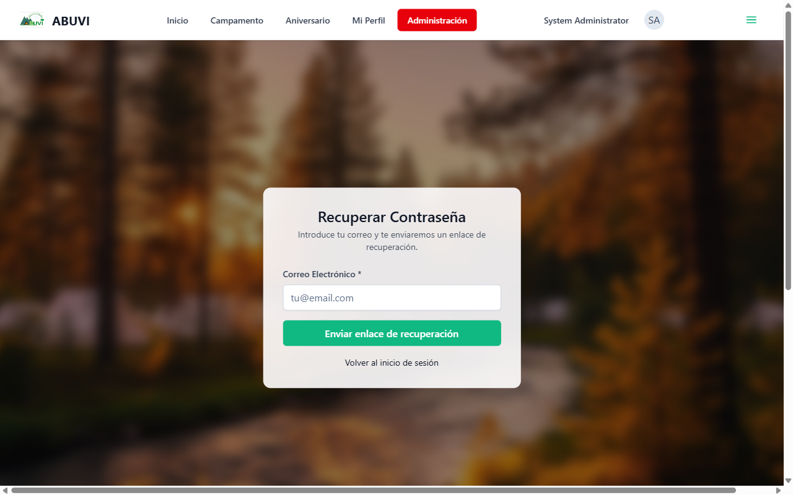
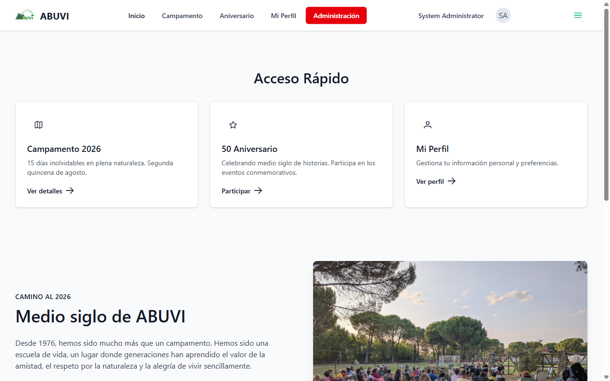
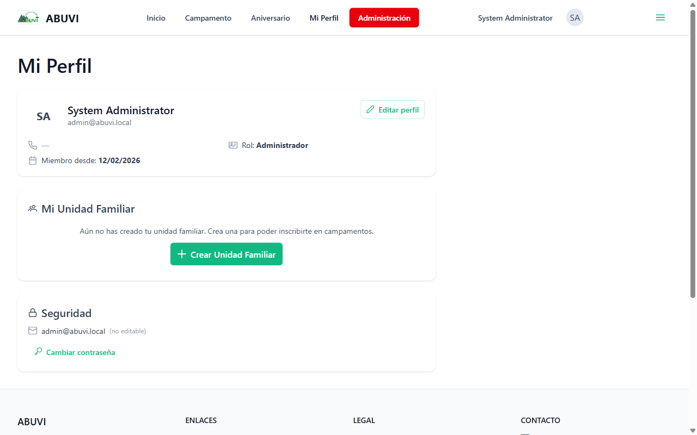
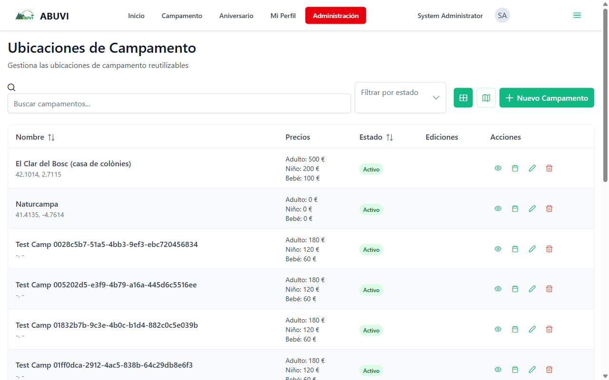
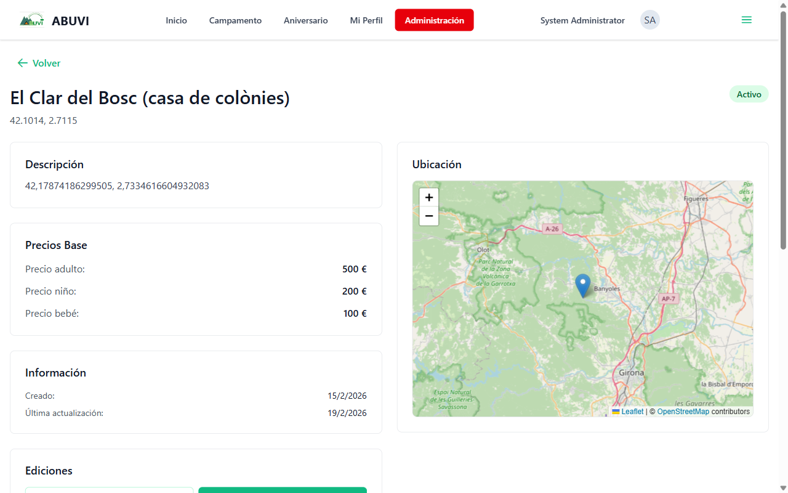
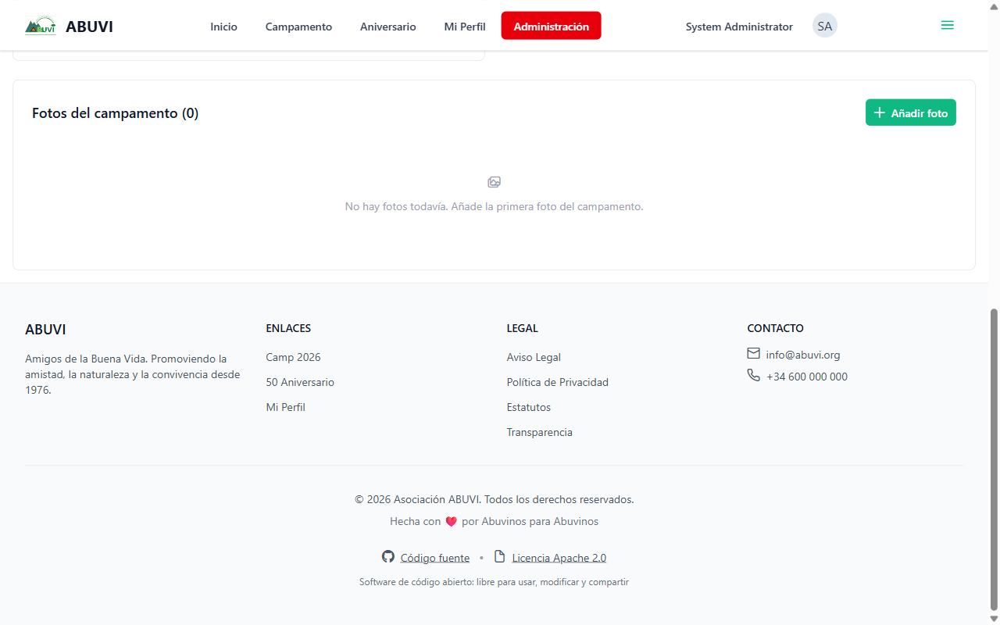

# Informe de Estado — Aplicación ABUVI

**Fecha:** 22 de febrero de 2026
**Para:** Miembros de la Junta Directiva
**Asunto:** Estado actual de la aplicación e inscripciones al campamento

---

## Resumen para la Junta

**Confirmamos que las inscripciones al campamento estarán disponibles antes del 28 de febrero.** Desde el último informe (17 de febrero) se han completado varias mejoras importantes, incluyendo el backend completo del sistema de inscripciones. Solo resta construir la pantalla que los socios verán para inscribirse.

---

## 1. ¿Qué está funcionando hoy?

### Acceso a la aplicación

Los socios pueden entrar con su correo y contraseña. Si alguien olvida su contraseña, ahora puede recuperarla directamente desde la pantalla de acceso: recibirá un correo con un enlace para crear una nueva.

El sistema de registro valida que quien se da de alta figure previamente como socio. **La carga inicial de todos los socios ya está preparada externamente**, lista para importar en el momento de activar las inscripciones.

---

### Recuperación de contraseña *(nuevo)*

Si un socio no recuerda su contraseña, puede introducir su correo y recibirá un enlace de recuperación. Este enlace caduca en 1 hora por seguridad.

---

### Página principal

Al entrar, el socio ve acceso rápido al campamento, al 50 aniversario y a su perfil. Los miembros de la Junta y administradores ven el botón rojo **"Administración"** para gestionar la plataforma.

---

### Mi Perfil *(completamente renovado)*

La sección de perfil ha sido rediseñada. Ahora cada socio puede:

- **Ver y editar** su nombre y teléfono
- **Ver su unidad familiar** (los miembros con los que se inscribirá al campamento) y crearla si aún no la tiene
- **Cambiar su contraseña** directamente desde aquí

> La sección "Mi Unidad Familiar" es clave para las inscripciones: el socio define aquí qué miembros forman parte de su familia, y el sistema usa esa información para calcular el precio del campamento automáticamente.

---

### Gestión de ubicaciones de campamento

La Junta puede gestionar todas las ubicaciones donde se celebran los campamentos. Cada ubicación muestra sus precios base por adulto, niño y bebé, y su estado.

Al entrar en el detalle de una ubicación se ve el mapa de localización, los precios y la galería de fotos. La Junta puede añadir fotos del lugar para que los socios sepan cómo es el sitio antes de inscribirse.

---

### Gestión de socios (Usuarios)

La Junta puede ver y gestionar todos los socios registrados: nombre, correo, rol y estado.

Desde aquí se puede:

- Ver qué socios se han dado de alta en la aplicación
- Asignar el rol de Junta a un usuario
- Desactivar cuentas si es necesario

---

## 2. Lo que se ha completado esta semana

Desde el último informe (17 de febrero) se han completado estas mejoras:

| Mejora | Completada |
| ------ | ---------- |
| Recuperación de contraseña (backend + frontend) | 22 feb |
| Galería de fotos y capacidad de alojamiento en campamentos | 18 feb |
| Extras de edición de campamento (backend completo) | 20 feb |
| Mi Perfil rediseñado con unidad familiar y seguridad | 22 feb |
| **Backend completo del sistema de inscripciones** | 22 feb |

El punto más importante: **el backend de inscripciones está terminado**. Toda la lógica de negocio está funcionando:

- Cálculo automático de precio según edades (adulto, niño, bebé)
- Control de plazas disponibles
- Gestión de extras opcionales (material, menús especiales, etc.)
- Validación de que la familia tiene todos los datos necesarios
- Bloqueo de dobles inscripciones

---

## 3. ¿Qué falta para abrir las inscripciones?

Solo falta la **pantalla de inscripción** que los socios usarán. El sistema de fondo está listo; hay que conectarlo con la interfaz visual.

El flujo completo que verá el socio:

1. Entra a "Campamento 2026"
2. Pulsa "Inscribir a mi familia"
3. Selecciona qué miembros de la familia vienen
4. El sistema calcula el precio automáticamente según edades
5. Selecciona extras si los hay
6. Ve el desglose total y confirma
7. La inscripción queda en estado **"Pendiente de pago"**

---

## 4. ¿Para cuándo estará listo?

Estamos a 22 de febrero. Con el backend ya terminado, solo falta la parte visual:

| Tarea restante | Tiempo estimado |
| -------------- | --------------- |
| Pantalla de inscripción (frontend) | 2-3 días |
| Pruebas y correcciones | 1-2 días |
| Puesta en marcha | 1 día |
| **Total** | **4-6 días hábiles** |

**Fecha comprometida: 28 de febrero de 2026.** Es alcanzable.

---

## 5. Estado actualizado de la aplicación

| Sección | Estado |
|---------|--------|
| Acceso (login / registro) | ✅ Funcionando |
| Recuperación de contraseña | ✅ Funcionando *(nuevo)* |
| Verificación de socios en el registro | ✅ Funcionando |
| Mi Perfil con unidad familiar | ✅ Funcionando *(renovado)* |
| Gestión de usuarios (Junta) | ✅ Funcionando |
| Gestión de ubicaciones de campamento | ✅ Funcionando |
| Galería de fotos de campamentos | ✅ Funcionando *(nuevo)* |
| Backend de inscripciones (cálculo de precios, plazas, extras) | ✅ Completado *(nuevo)* |
| **Pantalla de inscripción (frontend)** | 🔄 En desarrollo |
| Pago online | 📋 Planificado (siguiente paso) |
| Panel de administración de inscripciones | 📋 Planificado |

---

## Conclusión

El avance esta semana ha sido significativo. **El sistema de inscripciones está listo por dentro**; solo falta la pantalla que los socios verán. La fecha del 28 de febrero es realista.

Una vez abiertas las inscripciones, el siguiente paso será el pago online. El sistema ya tiene la lógica preparada: el socio verá cuánto debe, podrá pagar en partes si es necesario, y recibirá confirmación por correo cuando el pago esté completo.

Si la Junta desea ver una demostración en directo, estamos disponibles.

---

*Informe actualizado el 22 de febrero de 2026*
