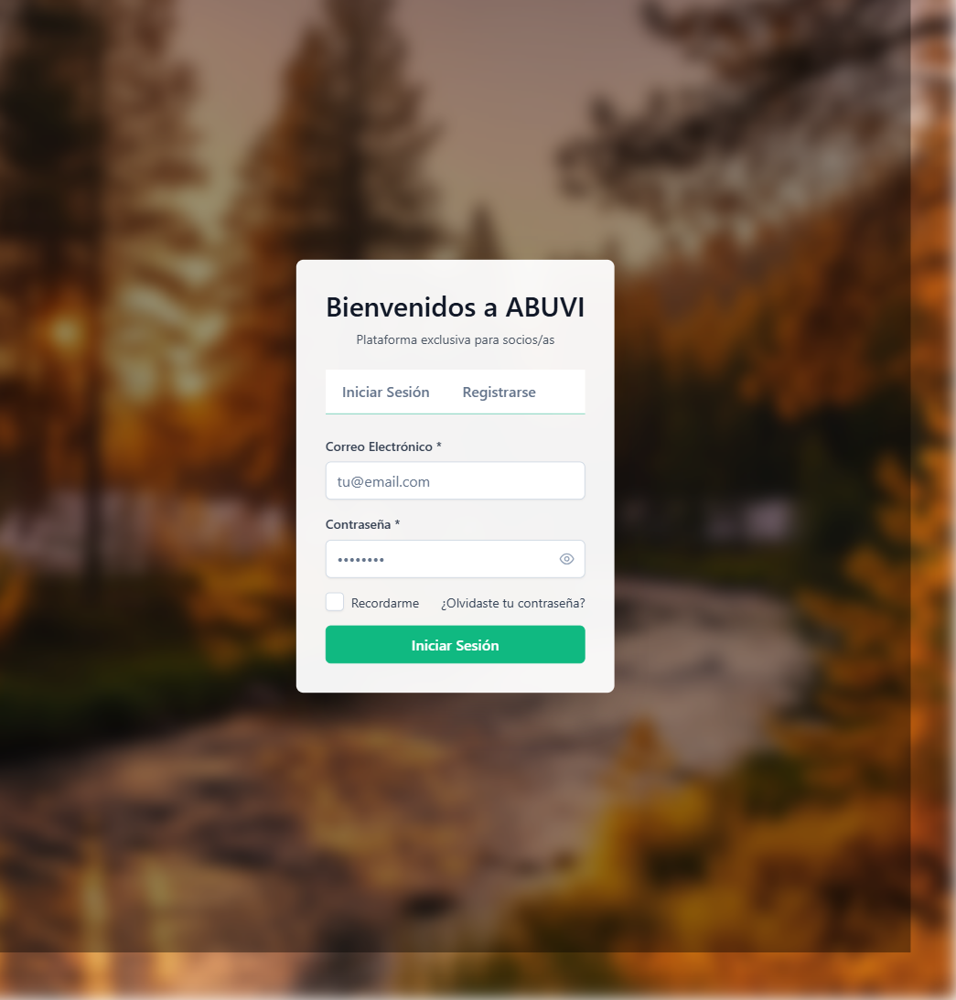
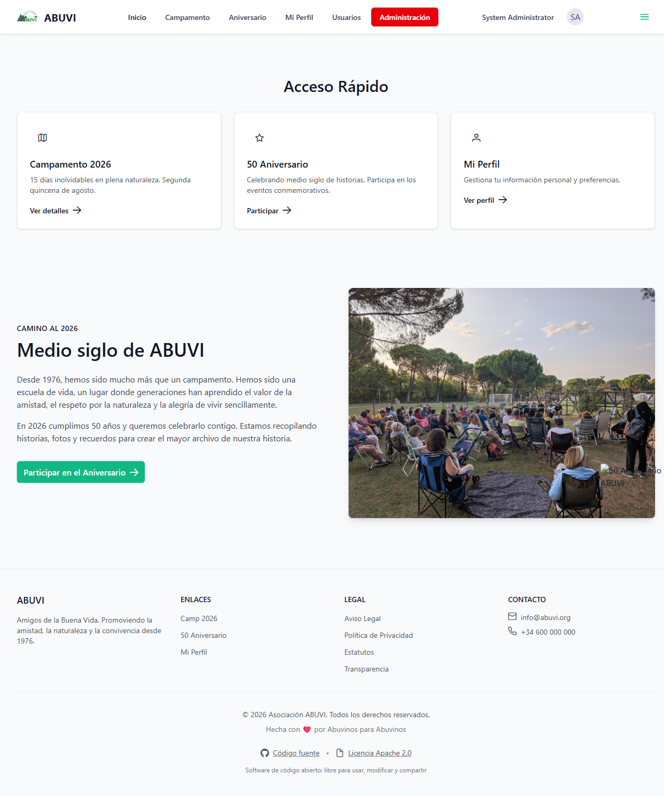
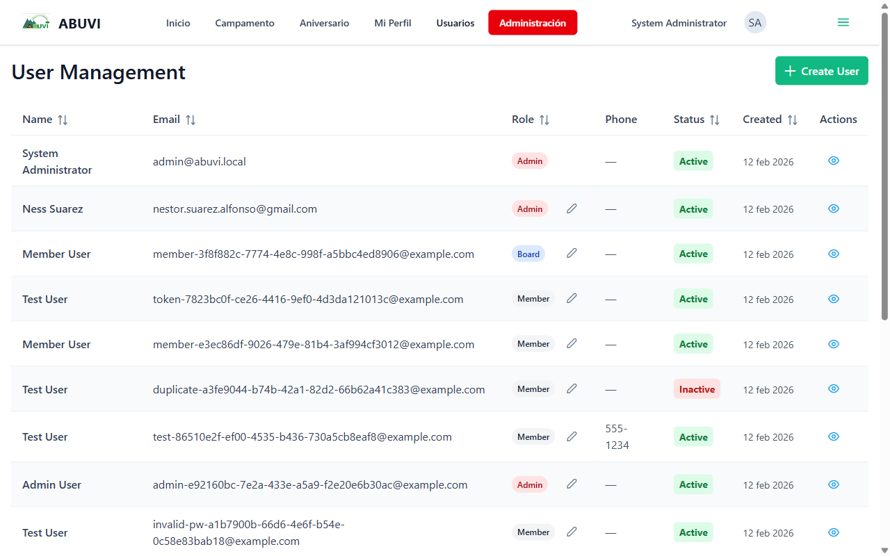
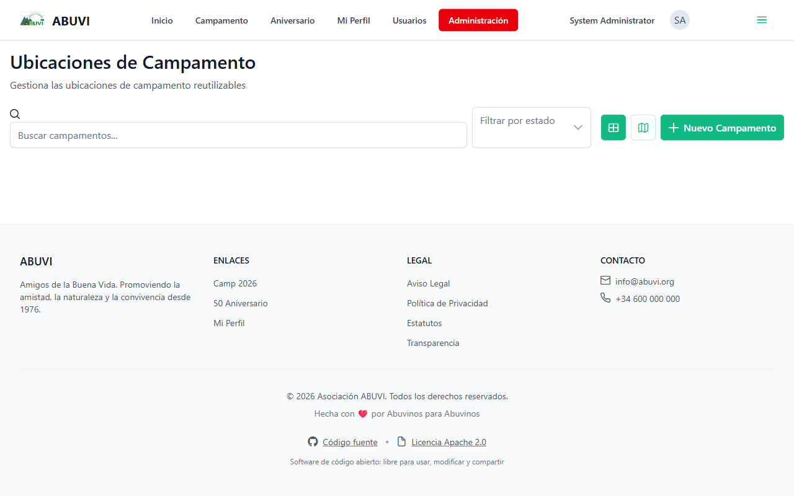
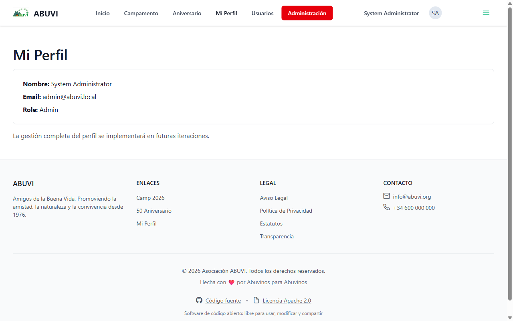

# Informe de Estado — Aplicación ABUVI

**Fecha:** 17 de febrero de 2026
**Para:** Miembros de la Junta Directiva
**Asunto:** Estado actual de la aplicación e inscripciones al campamento

---

## Resumen para la Junta

La buena noticia es que **sí podemos abrir las inscripciones al campamento antes de que acabe el mes**. La fecha más realista para tenerlo listo y en funcionamiento es el **28 de febrero de 2026**.

A continuación explicamos en detalle qué tiene ya la aplicación, qué falta y cuándo estará listo.

---

## 1. ¿Qué está funcionando hoy?

### Acceso a la aplicación

Los socios pueden entrar a la aplicación con su correo y contraseña. El sistema verifica que la persona sea socia antes de dejarle acceder.

**Pantalla de acceso:**

El sistema de registro está preparado para que, en el momento de activar las inscripciones, los socios se den de alta con su correo. **La carga inicial de todos los socios ya está preparada externamente**, por lo que el sistema podrá validar que quien se registra es efectivamente socio.

---

### Página principal (una vez dentro)

Al entrar, el socio ve un panel con acceso rápido a las secciones principales:

Desde aquí se accede al campamento, al aniversario y al perfil personal. La barra superior muestra las diferentes secciones. Los miembros de la Junta o administradores ven también el botón rojo de **"Administración"**.

---

### Gestión de socios (Usuarios)

La Junta puede ver y gestionar todos los usuarios registrados: nombre, correo, rol (Admin, Junta, Socio) y estado (Activo / Inactivo).

Esto permite a la Junta:

- Ver qué socios se han registrado en la aplicación
- Cambiar el rol de un usuario (por ejemplo, asignar permisos de Junta)
- Ver quién está activo o inactivo

---

### Gestión de ubicaciones de campamento

Existe una sección para gestionar los lugares donde se realizan los campamentos. Permite añadir nuevas ubicaciones, buscarlas y filtrarlas.

El backend ya tiene implementada la lógica completa de:

- Gestión de ediciones de campamento (años, fechas, precios, aforo)
- Control de estado de cada edición (Borrador → Abierto → Cerrado → Completado)
- Cálculo de precios por tramos de edad (Bebé, Niño, Adulto)
- Gestión de extras (material, menús especiales, transporte, etc.)

---

### Mi Perfil

Cada socio puede ver su información básica: nombre, correo y rol.

---

## 2. ¿Qué falta para las inscripciones?

Lo único que falta es **la pantalla de inscripción** que los socios verán para apuntarse al campamento. El sistema de fondo (cálculo de precios, control de plazas, validaciones) ya está diseñado y documentado al detalle. Solo hay que construir la pantalla y conectarla.

El flujo que verá el socio será:

1. Entra a la app → va a "Campamento 2026"
2. Hace clic en "Inscribir a mi familia"
3. Selecciona qué miembros de la familia vienen
4. El sistema calcula automáticamente el precio según las edades (adulto, niño, bebé)
5. Selecciona extras si los hay (material de acampada, menús especiales, etc.)
6. Ve el desglose total y confirma la inscripción
7. La inscripción queda en estado **"Pendiente"** hasta que se complete el pago

El precio se calcula solo, sin que el socio tenga que hacer nada. El sistema sabe la edad de cada miembro de la familia y aplica la tarifa que corresponda.

---

## 3. ¿Para cuándo estará listo?

| Tarea | Tiempo estimado |
|-------|-----------------|
| Pantalla de inscripción | 3-4 días |
| Pruebas y correcciones | 2-3 días |
| Puesta en marcha | 1 día |
| **Total** | **6-8 días hábiles** |

**Fecha comprometida: 28 de febrero de 2026.**

Esto da margen suficiente para que los socios puedan inscribirse antes de que acabe el mes.

> **Nota sobre los socios:** La carga inicial de la base de datos de socios ya está preparada. En el momento en que un socio intente registrarse en la app, el sistema comprobará que figura como socio en esa base de datos. Si es así, puede entrar. Si no lo es, no podrá.

---

## 4. Lo que vendrá después (ya planificado)

Una vez abiertas las inscripciones, el siguiente paso será integrar el pago online. El sistema ya tiene toda la lógica preparada:

- El socio ve cuánto debe pagar y puede hacer ingresos parciales
- Cuando el pago está completo, la inscripción pasa automáticamente a **"Confirmada"**
- El socio recibe un correo de confirmación

También están planificadas para más adelante:

- Gestión de unidades familiares (que cada socio gestione su grupo familiar)
- Panel de administración completo para la Junta (ver todas las inscripciones, familias, estadísticas)
- Exportación de datos a Excel/CSV

---

## 5. Resumen visual del estado actual

| Sección | Estado |
|---------|--------|
| Acceso a la app (login/registro) | ✅ Funcionando |
| Verificación de socios | ✅ Funcionando |
| Gestión de usuarios | ✅ Funcionando |
| Gestión de ubicaciones de campamento | ✅ Funcionando |
| Ediciones de campamento (backend) | ✅ Implementado |
| Cálculo de precios por edad | ✅ Implementado |
| **Pantalla de inscripción (frontend)** | 🔄 En desarrollo |
| Pago online | 📋 Planificado |
| Panel de administración completo | 📋 Planificado |

---

## Conclusión

**Sí es posible tener abierto el proceso de inscripción antes del 28 de febrero.** La base técnica está hecha; solo falta construir la pantalla que los socios verán para inscribirse. El equipo de desarrollo está en ello y la fecha es realista.

Si la Junta quiere ver alguna sección de la aplicación en directo o tiene alguna pregunta, estamos disponibles para hacer una demostración.

---

*Informe preparado el 17 de febrero de 2026*
